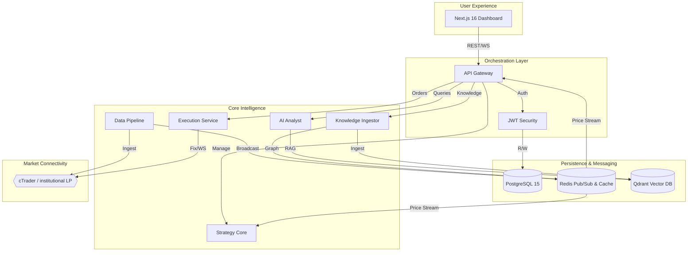

# 🏛️ MTF Olympus (v2.2)

**The Institutional Wealth Operating System for XAU/USD (Gold).**

[](https://github.com/damrongsak/mtf-trading-system)
[](specs/10_implementation_status.md)
[](LICENSE)

---

## 🌩️ Start with Why: The Wealth OS Vision

Most retail traders are trapped in a cycle of "Gambler’s Ruin"—fighting the market with fragmented tools, lying backtests, and unchecked psychology. **MTF Olympus** democratizes the institutional edge by transforming trading from a gamble into a rigorous engineering discipline.

We don't build trading bots. We build **Fund Managers**.

### The 5 Pillars of Wealth OS
1.  **The Foundry**: Standardized "Lego Blocks" for institutional strategy creation.
2.  **The Alpha Engine**: Advanced statistical factor design via VectorBT.
3.  **The Proving Ground**: Hardcore Walk-Forward Validation to survive real-world variance.
4.  **The Risk Citadel**: Game Theoretic risk engine using **Minimax Regret**.
5.  **The AI Coach**: Psychological monitoring and real-time reasoning via **LangGraph**.

---

## 🏗️ Global System Architecture

MTF Olympus is a distributed multi-service ecosystem fronted by a modern Next.js dashboard and orchestrated via a high-fidelity API Gateway.



---

## 🤖 AI-Agent Operational Guide (Global)

To navigate this project as an AI Agent, use the following **System Discovery Path**:

1.  **Source of Truth**: All behavior is defined first in `specs/` (Data Model, API, Architecture).
2.  **Service Entry**: Each microservice has its own professional `README.md` detailing its specific dependencies and nodes.
3.  **Data Flow**: The platform utilizes **Event-Carried State Transfer (ECST)** for symbol metadata and **Async RPC** for order execution via Redis.
4.  **Backend Hub**: `services/api-gateway/app/main.py` is the primary router for the entire ecosystem.

---

## 📂 Service Directory

| Service | Category | Documentation | Core Function |
| :--- | :--- | :--- | :--- |
| **Data Pipeline** | L1: Probability | [README](services/data-pipeline/README.md) | High-performance tick ingestion & Sentiment flow. |
| **Strategy Core** | L2/L3: Structure | [README](services/strategy-core/README.md) | Vectorized strategy engine & Alpha design. |
| **AI Analyst** | L5: Intelligence | [README](services/ai-analyst/README.md) | LangGraph reasoning, RAG, & Psychological coaching. |
| **Execution** | L4: Risk | [README](services/execution/README.md) | Prioritized cTrader execution & Minimax Risk. |
| **Knowledge Ingestor** | L5: Ingestion | [README](services/knowledge-ingestor/README.md) | Hierarchical document ingestion for Knowledge Graphs. |
| **API Gateway** | Orchestration | [README](services/api-gateway/README.md) | Central Routing, Auth, & ECST synchronization. |

---

## 🛠️ Unified Development Workflow

### Prerequisites
-   **Docker Desktop** & Docker Compose
-   **uv**: `curl -LsSf https://astral.sh/uv/install.sh | sh`
-   **nvm/pnpm**: For frontend development.

### Quick Start
```bash
# 1. Clone & Setup
git clone https://github.com/damrongsak/mtf-trading-system.git
cd mtf-trading-system
cp .env.example .env

# 2. Launch Ecosystem
docker compose up --build

# 3. Verify Connectivity
# Frontend: http://localhost:3000
# API Docs: http://localhost:8000/docs
```

## 🧩 Spec-Driven Development (SDD)
The project strictly enforces SDD. Read the [Specs](specs/) before making logic changes:
- `01_architecture.md`: High-level system design.
- `03_data_model.yaml`: Relational and vector schema definitions.
- `04_api_spec.yaml`: Global API contracts.

---

## ⚠️ Disclaimer
**USE AT YOUR OWN RISK.** MTF Olympus is an educational quant platform. Automated trading involves significant risk of loss. The authors assume no responsibility for financial outcomes.

---
**MTF Olympus** | *Institutional Alpha at Scale*