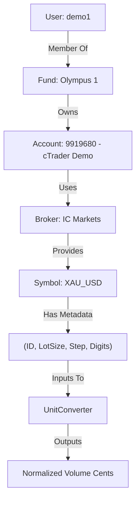

# Institutional Execution & Normalization Standard

This document defines the authoritative standard for how MTF Olympus handles volume, price, and risk calculations across its distributed microservices. It ensures **"Zero-Math Drift"** between internal logic and external broker requirements (e.g., IC Markets via cTrader).

## 1. Hierarchical Data Flow

MTF Olympus uses a strict hierarchical model to resolve execution context. Every trade request must traverse this chain to ensure RBAC and Risk compliance.



## 2. The "Zero-Math" Standard (100k Units)

To maintain consistency across diverse assets (Gold, Forex, Crypto), the system uses a single internal unit of measure:

- **1.0 Standard Lot = 100,000 Units**
- This applies regardless of the broker's native lot size.
- **Rule**: All services MUST store and transmit volume in these internal units. Ad-hoc math (e.g., `* 100` or `/ 100000`) is strictly forbidden outside of the `UnitConverter` adapter.

## 3. UnitConverter Normalization Algorithm

The `UnitConverter` is the ONLY authorized component for volume scaling.

### Volume Scaling (Internal -> Broker)
For cTrader/IC Markets:
```python
volume_cents = internal_units * (broker_lot_size_cents / 100_000)
```
- **Example (Gold)**: 1000 units (0.01 lot) on IC Markets (`lot_size_cents = 10,000,000`)
- `1000 * (10,000,000 / 100,000) = 100,000` Volume Cents.

### Price Rounding (Precision)
Stop-Loss (SL) and Take-Profit (TP) prices MUST be rounded to the symbol's `digits` metadata.
- **Rule**: `round(price, digits)`
- **Example (Gold)**: 2150.1234 → 2150.12 (if `digits=2`).

## 4. Metadata Cache (4-Tuple)

The `Execution` service maintains an L3 In-memory cache for symbols to ensure sub-millisecond execution resolution. Each entry is a 4-tuple:
1. `symbol_id`: The broker's internal numeric ID.
2. `lot_size_cents`: The broker's base unit scaling (usually 10^7 or 10^8).
3. `step_cents`: The minimum increment for volume (e.g., 100 cents = 1 unit).
4. `digits`: The decimal precision for price.

## 5. Diagnostic Verification

Both AI agents and users can verify the system's reasoning via the inspection API:
- **Endpoint**: `GET /inspect/account/{account_id}/symbol/{symbol}`
- **Verification**: Cross-reference the "Dry Run" output with this document to ensure the system is behaving as an "Institutional Pro".

---
**MTF Olympus** | *Alpha Through Standardized Execution*
