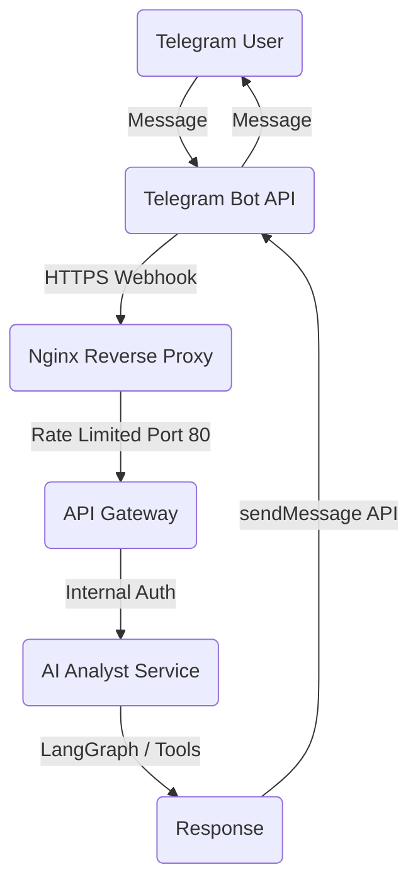

# Telegram Integration Guide - MTF Olympus

This guide covers everything you need to set up, configure, and troubleshoot the Telegram bot integration for MTF Olympus.

## 🏗️ Architecture

MTF Olympus uses a webhook-based architecture for real-time interaction with the AI Analyst via Telegram.



## ⚙️ Configuration

All Telegram settings are centralized in the `.env` file at the project root.

```bash
# Telegram Configuration
TELEGRAM_CHAT_ID=your_chat_id                                                 # Your numeric Telegram ID
TELEGRAM_BOT_TOKEN=123456:ABC-DEF...                                          # Token from @BotFather
TELEGRAM_WEBHOOK_URL=https://your-domain.com/api/v1/telegram/webhook          # Publicly accessible endpoint
TELEGRAM_WEBHOOK_SECRET=mtf_olympus_webhook_secret                          # Secret for signature validation
```

### Retrieving Chat ID
Message [@userinfobot](https://t.me/userinfobot) on Telegram to find your unique numeric `chat_id`.

---

## 🚀 Setup & Registration

### 1. Register the Webhook
MTF Olympus includes a script to register your webhook with Telegram using the values from your `.env`.

**Local Development (with ngrok):**
1. Start ngrok: `ngrok http 80`
2. Update `TELEGRAM_WEBHOOK_URL` in `.env` with the ngrok HTTPS URL.
3. Run setup:
   ```bash
   python3 scripts/configure_telegram_webhook.py setup
   ```

**Check Status:**
```bash
python3 scripts/configure_telegram_webhook.py info
```

### 2. Link Your Account
To associate your Telegram chat with your MTF user account, use the linking endpoint:

```bash
curl -X POST "http://localhost/api/v1/telegram/link" \
  -H "Authorization: Bearer YOUR_JWT_TOKEN" \
  -H "Content-Type: application/json" \
  -d '{"chat_id": YOUR_CHAT_ID}'
```

---

## 🌐 Nginx Proxy Setup

Using Nginx is recommended for production and local testing to handle rate limiting and security.

### Production (with SSL/Certbot)
Configure Nginx to serve as the entry point for your domain and proxy requests to the `api-gateway`.

```nginx
server {
    listen 443 ssl;
    server_name mtf.yourdomain.com;
    
    # Rate limiting zone
    limit_req zone=telegram_webhook burst=10 nodelay;

    location /api/v1/telegram/webhook {
        proxy_pass http://api-gateway:8000;
        proxy_set_header X-Telegram-Bot-Api-Secret-Token $http_x_telegram_bot_api_secret_token;
    }
}
```

### Local Development (Quick Setup)
Refer to `infra/nginx/default.conf` which already includes the basic routing for `/api/v1/telegram/webhook`.

---

## 🧪 Testing Scenarios

Once linked, you can send various commands to your bot:

1.  **Account Inquiry**: *"What's my account balance?"*
2.  **Market Analysis**: *"Analyze XAUUSD on H1 timeframe"*
3.  **Trade Planning**: *"Plan a trade for XAUUSD on M5"*

### Monitoring Logs
```bash
# Webhook arrival (Nginx)
docker compose logs nginx -f | grep telegram

# Business Logic (API Gateway)
docker compose logs api-gateway -f | grep telegram

# AI Processing (AI Analyst)
docker compose logs ai-analyst -f
```

---

## ⚠️ Troubleshooting & FAQ

**Q: "Account Not Linked" message in Telegram?**
**A:** Run the Link Account Step (Step 2) again with a valid JWT token.

**Q: Webhook not receiving messages?**
**A:** 
1. Check if `ngrok` has restarted (URL changes).
2. Verify webhook status: `python3 scripts/configure_telegram_webhook.py info`.
3. Check Nginx logs for `429 Too Many Requests` (Rate limiting).

**Q: Error 2132 or Order Rejection?**
**A:** Check the AI Analyst logs. The agent will usually explain the rejection reason provided by the Execution service or Risk engine.

---
**MTF Olympus** | *Institutional Alpha at Scale*
