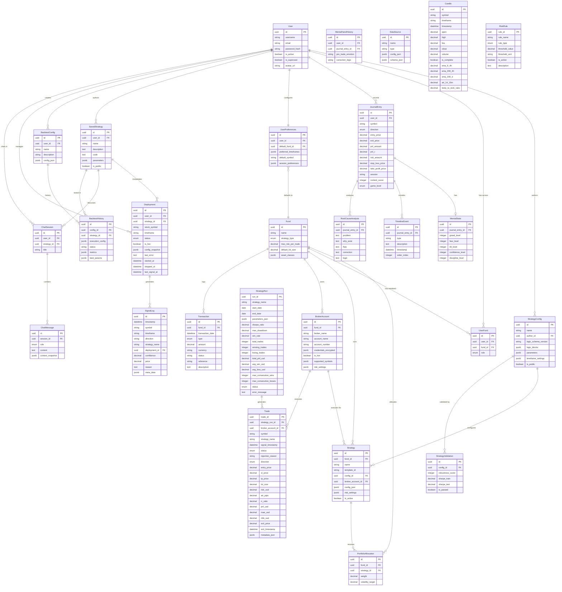

# Database Schema (ERD)

This document visualizes the data model defined in `specs/03_data_model.yaml`.

### strategy_configs
*Standardized Strategy Logic (The Blueprint)*

| Column | Type | Constraints | Description |
| :--- | :--- | :--- | :--- |
| id | UUID | PK | |
| name | VARCHAR(100) | NN | |
| logic_blocks | JSONB | NN | Trend, Structure, Momentum blocks |
| parameters | JSONB | NN | Global params |
| timeframe_settings| JSONB | NN | e.g. {"exec": "15m"} |

### strategy_validations
*Walk-Forward Analysis Results*

| Column | Type | Constraints | Description |
| :--- | :--- | :--- | :--- |
| id | UUID | PK | |
| config_id | UUID | FK | |
| robustness_score | INTEGER | NN | 0-100 Score |
| is_passed | BOOLEAN | | Validated status |

### portfolio_allocations
*Risk Parity Weightings*

| Column | Type | Constraints | Description |
| :--- | :--- | :--- | :--- |
| id | UUID | PK | |
| fund_id | UUID | FK | |
| strategy_id | UUID | FK | |
| weight | DECIMAL | NN | 0.0 - 1.0 |
| volatility_target| DECIMAL | | Annualized Vol Target |

### mental_hand_histories
*Psychological Reflections*

| Column | Type | Constraints | Description |
| :--- | :--- | :--- | :--- |
| id | UUID | PK | |
| user_id | UUID | FK | |
| journal_entry_id | UUID | FK | |
| pre_trade_emotion| VARCHAR | | |
| correction_logic | TEXT | | CBT Logic |
