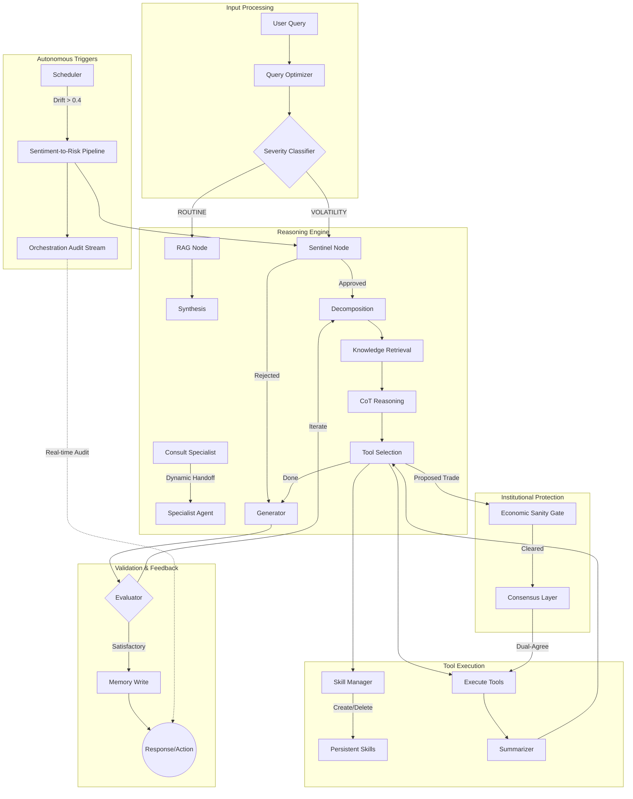

# MTF Olympus: AI Analyst (v2.9)

The **AI Analyst** is the institutional-grade "Market Brain" of the MTF Olympus system. It utilizes **Google Gemini 2.5 (Pro/Flash)** and **OpenRouter (Claude 3.5)** within an **Agentic RAG (LangGraph)** architecture to provide structural market mapping, cross-service stability observation, and automated strategy planning with institutional safety guards.

## 🏗️ Agentic Architecture (Autonomous Dynamic Topology)

The service orchestrates complex reasoning flows through a multi-node Directed Acyclic Graph (DAG) with **Dynamic Topology**. In Phase 4, the system has evolved into an **Autonomous Orchestration Engine** that triggers workflows based on market events without user intervention.



## 🎯 Core Capabilities (v2.9+)

- **Autonomous Orchestration Monitor**: Real-time auditing of agent handoffs and pipeline triggers via the `orchestration.audit.stream`.
- **Specialist Handoff Flow**: Dynamic escalation to domain specialists (Strategy Advisor, Market Observer) via the `consult_specialist` mechanism.
- **Autonomous Meta-Skill Management**: The agent can autonomously create, refine, and delete its own specialized skills (`SKILL.md`) using the `skill_manager` meta-skill.
- **Dynamic Topology Routing**: Automatically escalates to `CRISIS` mode for high-volatility events detected by background observers.
- **Institutional Sentinel Gate**: Multi-model consensus and hard risk validation that prevents AI hallucinations from reaching market execution.
- **Automated Daily Post-Mortem**: (01:00 UTC) Self-correcting learning loop that transforms past trades into persistent RAG memory.

## 🤖 AI-Agent Operational Guide

To understand or extend the AI Analyst, follow this discovery path:

1.  **Persona & Prompts**: Core behavior in `app/core/prompts.py`.
2.  **Graph Structure**: Node wiring and dynamic routing in `app/agents/strategy_advisor.py`.
3.  **Safety Guards**: Risk logic in `app/agents/sentinel/economic_sanity_gate.py` and `app/agents/sentinel/consensus_layer.py`.
4.  **Learning Tasks**: Background jobs and post-mortem logic in `app/core/scheduler_tasks.py` and `app/agents/post_mortem.py`.

## 🔧 Operational Guide

### Diagnostic CLI & Verification
Probing the system or testing CRISIS flows:
```bash
# General Chat
docker compose exec ai-analyst python3 scripts/chat_cli.py

# Manual Daily Post-Mortem Trigger
docker compose exec ai-analyst python3 tests/manual_post_mortem_run.py

# Crisis Workflow Integration Test
docker compose exec ai-analyst python3 tests/test_crisis_workflow_integration.py

# Orchestration Monitoring API
GET /api/v1/orchestration/logs
GET /api/v1/orchestration/pipeline/status
```

### Common Issues & Fixes

| Symptom | Probable Cause | Fix |
| :--- | :--- | :--- |
| **Consensus Failures** | OpenRouter API Down | Check root `.env` for `OPENROUTER_API_KEY`; Verify fallback logs. |
| **Sanity Gate Rejection** | Missing SL/TP or Lot > 0.1 | Ensure trade proposals follow institutional risk limits. |
| **Serialization Errors** | UUID/Decimal in trades | Use `json_util` or string conversion in `scheduler_tasks.py`. |

## 🗄️ Managed Knowledge (Qdrant)

| Collection | Data Source | Purpose |
| :--- | :--- | :--- |
| `lesson_learned` | Daily Post-Mortem | Self-learning from past mistakes/wins |
| `user_memory` | Chat History | Long-term user preference tracking |
| `system_docs` | Specs/Codebase | Ensuring SDD compliance in agent reasoning |
| `quant_library` | PDFs/Books | Professional technical analysis context |

## 📂 Directory Structure

```text
app/
├── agents/            # LangGraph nodes, Sentinel, Post-Mortem, & Consensus
│   └── sentinel/      # Safety gate and multi-model consensus logic
├── core/              # Persona prompts, Pydantic schemas, & Scheduler
├── services/          # Model clients (Gemini/OpenRouter), RAG, & Memory
├── tools/             # Standardized Native BaseTools (SMC, OI, etc.)
├── skills/            # Internal persistent skills (SKILL.md Physical Skeleton)
├── routers/           # FastAPI routers (Agents, Ingest, Orchestration)
└── main.py            # FastAPI entrypoint & Scheduler init
```

## 📚 Dynamic Skills (agentskills.io Standard)

The agent dynamically discovers skills from two primary locations:
1.  **Internal**: `services/ai-analyst/skills/`
2.  **External/Examples**: `example/skills/`

Each skill follows the **Physical Skeleton** standard:
- `SKILL.md`: Frontmatter + Instructions.
- `references/`: Contextual data injected into sub-agents.
- `scripts/`: Executable assets.
```

## 🛠️ Development

Uses `uv` for lightning-fast dependency management.

```bash
# Install environment
uv sync

# Run locally
uv run uvicorn app.main:app --reload --port 8000
```

---
**MTF Olympus** | *Institutional Alpha at Scale*
