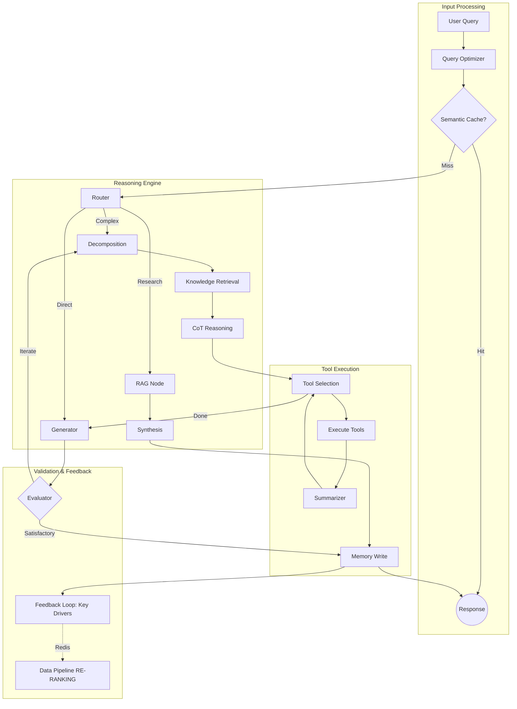

# MTF Olympus: AI Analyst

The **AI Analyst** is the institutional-grade "Market Brain" of the MTF Olympus system. It utilizes **Google Gemini 2.5 (Pro/Flash)** within an **Agentic RAG (LangGraph)** architecture to providing structural market mapping, cross-service stability observation, and automated strategy planning.

## 🏗️ Agentic Architecture

The service orchestrates complex reasoning flows through a multi-node Directed Acyclic Graph (DAG) powered by LangGraph.



## 🎯 Core Capabilities

- **Agentic RAG**: Context-aware retrieval from **Qdrant** (Quant Library, Systems Docs, Journals) with iterative self-correction.
- **Layer 0 Ingestion**: Direct **Redis Stream** access for sub-2ms spot price fetching, bypassing standard HTTP bottlenecks.
- **Semantic Caching**: Redis-backed hashing to prevent redundant LLM invocations for identical research queries.
- **Geopolitical Intelligence**: Specialized sentiment filtering for XAUUSD, detecting high-impact events like consulate evacuations, military strikes, and sanctions.
- **Adaptive News Re-ranking (Mini-RL)**: Dynamic feedback loop that extracts "Key Drivers" from news and re-ranks subsequent news syncs in the Data Pipeline for 10x faster response to volatility.
- **Context Pruning**: Intelligent `Summarizer` node to aggressively condense tool outputs, preventing token saturation.

## 🤖 AI-Agent Operational Guide

To understand or extend the AI Analyst, follow this discovery path:

1.  **Persona & Prompts**: The "Source of Truth" for agent behavior is in `app/core/prompts.py`.
2.  **Graph Structure**: The node wiring and state management are defined in `app/agents/strategy_advisor.py`.
3.  **Tool Registry**: New capabilities should be added to `app/tools/` and registered in `app/core/bootstrap.py`.
4.  **Vector Memory**: Collection schemas and logic reside in `app/services/rag.py` and `app/services/memory.py`.

## 🔧 Operational Guide

### Common Issues & Fixes

| Symptom | Probable Cause | Fix |
| :--- | :--- | :--- |
| **Token Limit Errors** | Scratchpad context bloat | Ensure `summarizer` node is active; check `TokenMonitor` logs. |
| **Tool Hallucinations** | Vague tool descriptions | Refine Pydantic schemas in `app/core/schemas/`. |
| **Old Context Bleeding** | Stale Redis Checkpoints | Use `/new` command in CLI to violently reset session state. |

### Diagnostic CLI
Probing the system without the frontend:
```bash
docker compose exec ai-analyst python3 scripts/chat_cli.py
```

## 🗄️ Managed Knowledge (Qdrant)

| Collection | Data Source | Ingestion Path |
| :--- | :--- | :--- |
| `quant_library` | PDFs/Books | `/api/v1/ai/library/ingest` |
| `system_docs` | Specs/Codebase | `/api/v1/ai/admin/sync_docs` |
| `strategies` | Python Templates | Auto-vectorized on save |

## � Directory Structure

```text
app/
├── agents/            # LangGraph node definitions & state graphs
├── core/              # Persona prompts & Pydantic execution schemas
├── services/          # Gemini, RAG (Qdrant), & Stability Observers
├── tools/             # Operational capabilities (Redis Spot, SMC, Search)
└── main.py            # FastAPI routers & agent instance lifespan
```

## �🛠️ Development

Uses `uv` for lightning-fast dependency management.

```bash
# Install environment
uv sync

# Run locally
uv run uvicorn app.main:app --reload --port 8000
```

---
**MTF Olympus** | *Institutional Alpha at Scale*
