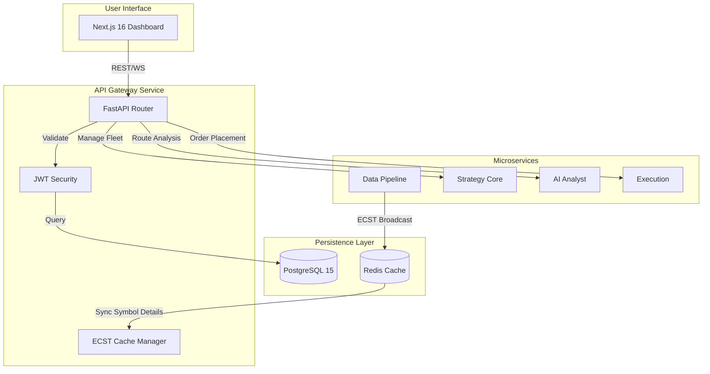

# MTF Olympus: API Gateway

The **API Gateway** is the central nervous system of the MTF Olympus platform. It serves as the primary entry point for all frontend requests, orchestrating authentication, routing to microservices, and managing the core database state.

## 🏗️ System Connectivity

The Gateway maintains high-fidelity synchronization across the distributed stack, acting as the bridge between the user-facing dashboard and the various specialized engines.



## 🎯 Core Responsibilities

- **Authentication & Security**: Robust JWT-based security layer with encrypted credential management for broker accounts.
- **Event-Carried State Transfer (ECST)**: Localized caching of symbol metadata broadcasted by the `data-pipeline`, ensuring zero-latency symbol lookup.
- **Trade Journaling**: Direct integration with PostgreSQL for high-fidelity trade logging and psychological data capture.
- **Portfolio Management**: Hierarchical management of Funds, Accounts, and Risk Rules via SQLAlchemy (Async).
- **Service Orchestration**: Unified API proxying to `ai-analyst`, `strategy-core`, and `execution` services.

## 🤖 AI-Agent Operational Guide

To navigate or modify the Gateway behavior, follow this priority path:

1.  **API Contracts**: All endpoints adhere to the [API Spec](../../specs/04_api_spec.yaml).
2.  **Routing Hub**: The main router assembly is in `app/main.py`.
3.  **Data Models**: Database schemas are defined in `app/models/` and must match the [Data Model Spec](../../specs/03_data_model.yaml).
4.  **Business Logic**: Core service logic (e.g., Auth, ECST sync) resides in `app/services/`.

## 🚦 Operational Guide

### Common Issues & Fixes

| Symptom | Probable Cause | Fix |
| :--- | :--- | :--- |
| **Auth Failures** | Redis cache expiry or DB mismatch | Check `REDIS_URL` and `DATABASE_URL` connectivity. |
| **Missing Symbol Data** | ECST Sync failure from Data-Pipeline | Check Redis Pub/Sub status; verify Data-Pipeline is healthy. |
| **Database Lock Wait** | Large historical trade imports | Optimize `repositories/` queries or check PG session limits. |

### Management Commands
```bash
# Sync database schema (Alembic)
docker compose exec api-gateway alembic upgrade head

# Initialize system data (Seed)
docker compose exec api-gateway python scripts/seed_risk_rules.py
```

## 📂 Directory Structure

```text
app/
├── routers/           # Feature-specific API endpoints (Auth, Journal, etc.)
├── models/            # SQLAlchemy database models (PostgreSQL)
├── services/          # Cross-cutting logic (ECST, Auth, Ingest)
├── schemas/           # Pydantic data validation & serialization
├── streaming/         # Redis stream subscribers & websocket managers
└── main.py            # Gateway assembly & dependency bootstrap
```

## 🛠️ Development

Uses `uv` for dependency management.

```bash
# Install environment
uv sync

# Run locally
uv run uvicorn app.main:app --reload --port 8000
```

---
**MTF Olympus** | *Institutional Alpha at Scale*
