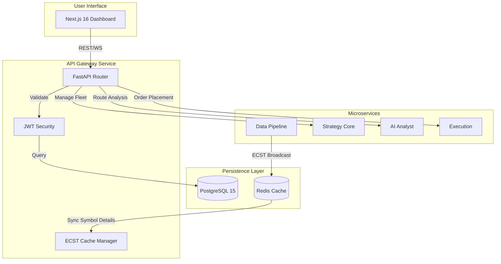

# MTF Olympus: API Gateway

The **API Gateway** is the central nervous system of the MTF Olympus platform. It serves as the primary entry point for all frontend requests, orchestrating authentication, routing to microservices, and managing the core database state.

## 🏗️ System Connectivity

The Gateway maintains high-fidelity synchronization across the distributed stack, acting as the bridge between the user-facing dashboard and the various specialized engines.



## 🎯 Core Responsibilities

- **Authentication & Security**: Robust JWT-based security layer with encrypted credential management for broker accounts.
- **Event-Carried State Transfer (ECST)**: Localized caching of symbol metadata broadcasted by the `data-pipeline`, ensuring zero-latency symbol lookup.
- **Trade Journaling**: Direct integration with PostgreSQL for high-fidelity trade logging and psychological data capture.
- **Portfolio Management**: Hierarchical management of Funds, Accounts, and Risk Rules via SQLAlchemy (Async).
- **Service Orchestration**: Unified API proxying to `ai-analyst`, `strategy-core`, and `execution` services.
- **Institutional Resilience**:
    - **Global Kill Switch** (`/halt`, `/resume`).
    - **Persistent Connection Pooling**: Shared `httpx` sessions to eliminate TCP/SSL handshake overhead (HFT-lite).
    - **Transient Retry Logic**: Automatic retries for `ConnectionResetError` and network jitter.
- **Production-Grade WebSocket Channel** (Sprint G — implemented):
    - **[G1] Heartbeat**: FIX Protocol-style ping/pong every 30s. Missing pong → auto close (code 1001).
    - **[G2] Circuit Breaker**: Hystrix-pattern CLOSED/OPEN/HALF-OPEN state machine. 5 failures → instant reject. 30s recovery probe.
    - **[G4] Structured Logging**: JSON audit log per command with `trace_id`, `latency_ms`, truncated `api_key`.
    - **[G5] Reconnect SDK**: Reference client at `tools/ws_client/mtf_ws_client.py` (exponential backoff, buffer, pong).
- **🔜 Sprint H — Production Hardening** (planned):
    - **[H1] Per-Command Rate Limiting**: Redis sliding window, tiered by category (TRADE: 5 rps, MANAGE: 20 rps, READ: 50 rps).
    - **[H2] Order Confirmation Callback**: 2-phase WS push — PENDING (immediate) + FILLED (async broker confirmation).
- **✅ Sprint I — Multi-Broker Excellence** (implemented):
    - **[I1] Provider-Specific Pricing**: WebSocket and REST endpoints now support `provider` filtering (OANDA/CTRADER) to prevent price collisions.
- **✅ Sprint J — cTrader Stabilization** (Complete 2026-03-10):
    - **[J1] Stable ID Schema**: Updated data models to prioritize `broker_trade_id` using cTrader position IDs, enabling reliable SL/TP amendments.
    - **[J2] Deduplicated Ingest**: Integrated `broker_deal_id` for fill events to prevent duplicate trade creation during asynchronous broker callbacks.
    - **[J3] Multi-Entity Reconciliation**: Janitor Service now synchronizes both open positions and pending orders, offering 100% state parity.
    - **[J4] MTF Scaling**: Verified full architectural support for H1, D1, W1, and MN1 symbol details broadcast.
- **✅ Sprint K — Broker Verification Hardening** (Complete 2026-03-14):
    - **[K1] Live Credential Validation**: Integrated mandatory broker-side verification for `CTRADER`, `ICMARKETS`, and `ICMARKETSSC` during account creation via `data-pipeline`.
    - **[K2] Demo Activation Fix**: Resolved issue where demo accounts failed to activate by ensuring all required credentials (`client_id`, `client_secret`, `token`, `account_id`) are validated.
    - **[K3] Automatic Account Sync**: Added logic to automatically map `account_number` to `account_id` if missing, improving UX for cTrader-based brokers.
- **✅ Phase 56 — Institutional Risk Control** (Complete 2026-03-19):
    - **[P56-1] Risk Config API**: `GET/PATCH /api/v1/risk/fund/{fund_id}/config` for fund-level risk parameter management.
    - **[P56-2] Kill Switch**: `POST /api/v1/risk/fund/{fund_id}/kill-switch` for emergency fund halting.
- **✅ Phase 57 — AI-Driven Risk Rebalancer** (Complete 2026-03-19):
    - **[P57-1] AI Review Trigger**: `POST /api/v1/risk/ai-review` — triggers Gemini-based risk analysis via AI Analyst service.
    - **[P57-2] Apply Recommendation**: `POST /api/v1/risk/fund/{fund_id}/apply-recommendation` — applies AI-suggested risk parameters and broadcasts `RISK_REBALANCE_APPLIED` event to Execution Service.

## ⚡ Performance & Concurrency Guardrails (Critical)

The API Gateway operates on a **single-threaded Event Loop** (FastAPI/Uvicorn). Maintaining a non-blocking loop is critical for WebSocket stability and API responsiveness.

### 🚫 No Reentrant Gateway Calls (Deadlock Prevention)
**CRITICAL**: AI Agents and and internal services MUST NOT call the `api-gateway` endpoints to fetch data. 
- **Reason**: This creates circular dependencies and event-loop deadlocks (reentrant calls).
- **The Fix**: Use **Direct Service Calls** (e.g., `http://data-pipeline:8000`) for internal data gathering.

### 🚫 The Event Loop Blocking Rule
**MANDATORY**: You MUST NOT perform synchronous I/O (SQLAlchemy queries, heavy file reads, or long-polling) directly inside `async def` functions without offloading.

*   **Symptoms of Failure**: High CPU usage, "Missed run time" warnings from APScheduler, and dropped WebSocket connections.
*   **The Fix**: Use `asyncio.to_thread` to wrap synchronous database calls or blocking logic.

```python
# ❌ BAD: Blocks the entire gateway while waiting for DB
async def background_job():
    db = SessionLocal()
    results = db.query(MyModel).all() # BLOCKING
    db.close()

# ✅ GOOD: Offloads DB work to a thread pool
async def background_job():
    def get_data():
        db = SessionLocal()
        try:
            return db.query(MyModel).all()
        finally:
            db.close()
    
    results = await asyncio.to_thread(get_data) # NON-BLOCKING
```

### 🗄️ Database Access Patterns
Until the gateway is fully refactored to `AsyncSession` (SQLAlchemy 2.0+), follow these patterns:
1.  **FastAPI Routes**: Use `db: Session = Depends(get_db)`. FastAPI handles `def` (sync) routes in its own thread pool automatically.
2.  **Background Tasks/Workers**: If using `async def` for workers (e.g., `telegram_polling.py` or `scheduler.py`), you **must** use `asyncio.to_thread` for all DB operations.
3.  **Thread-Specific Sessions**: Always create, use, and **close** a new `SessionLocal()` within the threaded helper function to prevent connection leaks.

### 📦 Dependency Management
*   **Baseline Memory**: ~175MB (constrained by heavy libs like `pandas`, `numpy`, `vectorbt`).
*   **Guideline**: Do NOT add heavy computational libraries to the Gateway. Move all quantitative analysis or backtesting logic to the `strategy-core` service. The Gateway should remain a thin, fast orchestrator.

## 🤖 AI-Agent Operational Guide

To navigate or modify the Gateway behavior, follow this priority path:

1.  **API Contracts**: All endpoints adhere to the [API Spec](../../specs/04_api_spec.yaml).
2.  **Routing Hub**: The main router assembly is in `app/main.py`.
3.  **Data Models**: Database schemas are defined in `app/models/` and must match the [Data Model Spec](../../specs/03_data_model.yaml).
4.  **Business Logic**: Core service logic (e.g., Auth, ECST sync) resides in `app/services/`.

## 🚦 Operational Guide

### Common Issues & Fixes

| Symptom | Probable Cause | Fix |
| :--- | :--- | :--- |
| **Auth Failures** | Redis cache expiry or DB mismatch | Check `REDIS_URL` and `DATABASE_URL` connectivity. |
| **Missing Symbol Data** | ECST Sync failure from Data-Pipeline | Check Redis Pub/Sub status; verify Data-Pipeline is healthy. |
| **Connection Reset** | Transient network or peer closure | Gateway now auto-retries; check service- `GET /api/v1/health`: Basic availability check. |
| **Database Lock Wait** | Large historical trade imports | Optimize `repositories/` queries or check PG session limits. |

### 🔐 3rd Party Integration (HFT-lite)
For external consumers, use the dedicated `/api/v1/external` router.
- **WebSocket Channel**: High-speed command stream at `/ws/command`.
    - **Commands**: `execute`, `cancel`, `amend`, `close`, `get_account`, `get_orders`, `get_trades`.
    - **Heartbeat**: Server sends `{"type":"ping"}` every 30s — client must respond `{"type":"pong"}` within 10s.
    - **Circuit Breaker**: When Execution Service is down, commands return `{"status":"service_unavailable"}` instantly.
    - **Trace ID**: Every response includes `"trace_id"` for post-trade audit correlation.
    - **Rate Limits** (Sprint H, planned): TRADE 5 rps, CANCEL 20 rps, READ 50 rps — per `api_key`.
    - **Fill Callbacks** (Sprint H, planned): `execute` will emit 2 events — `PENDING` (immediate) + `FILLED` (async).
- **Security**: Requires HMAC-SHA256 signing.
- **Docs**: See **[specs/05_external_auth.md](../../specs/05_external_auth.md)** for signing instructions and examples.
- **SDK**: See **[tools/ws_client/mtf_ws_client.py](../../tools/ws_client/mtf_ws_client.py)** for Python reference client.

### 🤖 Institutional AI Integration (Async)
For 3rd party AI analysis, use the asynchronous `/ai/think` flow to avoid connection timeouts during deep reasoning.

1. **Get Token**:
   ```bash
   curl -X POST http://localhost:8000/api/v1/auth/token \
     -H "Content-Type: application/x-www-form-urlencoded" \
     -d "username=<USER>&password=<PASS>"
   ```

2. **Submit Job**:
   ```bash
   curl -X POST http://localhost:8000/api/v1/ai/think \
     -H "Authorization: Bearer <TOKEN>" \
     -H "Content-Type: application/json" \
     -d '{"message": "Analyze XAU/USD", "thread_id": "optional"}'
   ```
   *Returns `202 Accepted` with a unique `job_id`.*

3. **Poll Results**:
   ```bash
   curl -X GET http://localhost:8000/api/v1/ai/jobs/<JOB_ID> \
     -H "Authorization: Bearer <TOKEN>"
   ```

### 📡 Real-time Market Data (WebSockets)
Connect to the price feed for live institutional updates broadcasted via ECST.

- **Endpoint**: `ws://localhost:8000/api/v1/stream/prices`
- **Parameters**: 
    - `symbols`: Comma-separated list (e.g., `XAU_USD,EUR_USD`).
    - `token`: Your JWT Access Token.
- **Example**: `ws://localhost:8000/api/v1/stream/prices?symbols=XAU_USD&token=<TOKEN>`

### Management Commands
```bash
# Sync database schema (Alembic)
docker compose exec api-gateway alembic upgrade head

# Initialize system data (Full Sequence)
docker compose exec api-gateway python scripts/seed_system.py
docker compose exec api-gateway python scripts/seed_market_data.py
docker compose exec api-gateway python scripts/seed_risk_rules.py
docker compose exec api-gateway python scripts/seed_ctrader.py
docker compose exec api-gateway python scripts/seed_test_data.py

# Emergency Halt / Resume
docker compose exec api-gateway curl -X POST http://localhost:8000/api/v1/system/halt
docker compose exec api-gateway curl -X POST http://localhost:8000/api/v1/system/resume
```

## 📂 Directory Structure

```text
app/
├── routers/           # Feature-specific API endpoints (Auth, Journal, etc.)
├── models/            # SQLAlchemy database models (PostgreSQL)
├── services/          # Cross-cutting logic (ECST, Auth, Ingest)
├── schemas/           # Pydantic data validation & serialization
├── streaming/         # Redis stream subscribers & websocket managers
└── main.py            # Gateway assembly & dependency bootstrap
```

## 🛠️ Development

Uses `uv` for dependency management.

```bash
# Install environment
uv sync

# Run locally
uv run uvicorn app.main:app --reload --port 8000
```

---

## ⚠️ Design Notes (For Developers)

### 🔒 HITL — Human in the Loop (Phase 1)

> **Do NOT enable AUTO execution for Template Strategies without a deliberate review.**

By design, Phase 1 enforces **Human in the Loop** for all signals. Every signal generated by a Template Strategy must receive explicit human approval before any order is placed.

**Rules enforced in `routers/internal.py`**:
- **Template Strategies** (`strategy_id` payload): `execution_mode` is **hard-locked to `SEMI_AUTO`**, even if `config_json` specifies `AUTO`.
- **Deployment-based** (`deployment_id` payload): reads `execution_mode` directly from `config_snapshot` (explicit user intent).

**Correct Signal Flow**:
```
Signal Received
    → Persist to signal_logs (status = PENDING_APPROVAL)
    → Send Telegram notification to strategy owners
    → STOP — awaiting human approval ✋

Human approves via Dashboard /signals
    → Call execution service → place order ✅
```

**To enable AUTO execution in the future (Phase 2+)**:
1. Remove/modify the HITL guard in `receive_internal_signal` (around line ~93).
2. Update the spec in `specs/04_api_spec.yaml` first.
3. Implement the Approval endpoint `/api/v1/signals/{id}/approve` before enabling.

**`signal_logs.status` reference**:

| Status | Meaning |
|---|---|
| `CREATED` | Persisted (before Telegram send) |
| `PENDING_APPROVAL` | Awaiting human approval (SEMI_AUTO mode) |
| `PLACED` | Successfully sent to Execution Service |
| `EXECUTION_FAILED` | Execution call failed (signal still in DB) |
| `OPEN` / `CLOSED` | Trade lifecycle states |

---
**MTF Olympus** | *Institutional Alpha at Scale*
