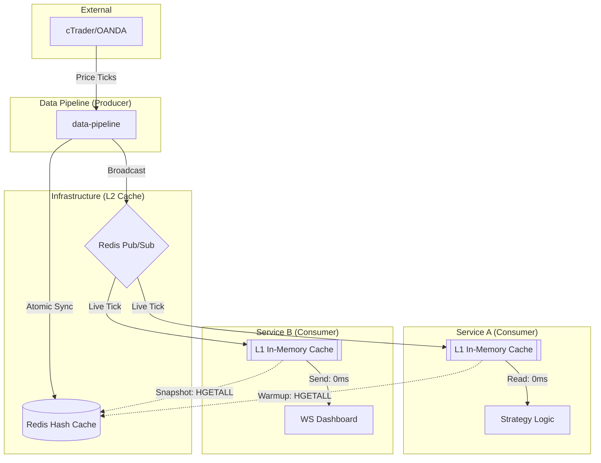

# Data Pipeline Service

The **MTF Olympus Data Pipeline** is the backbone of the system's market awareness. it is responsible for ingesting institutional-grade market data (Candlestick and Real-time Ticks), economic calendars, news, and COT reports.

## 🚀 Primary Data Source: cTrader
This service is optimized for **cTrader** as the primary institutional data provider, utilizing high-frequency tick streams for XAU/USD (Gold) and other FX pairs.

## 🏗️ High-Performance Caching Architecture

To support high-frequency trading and microsecond latency for consumer services, the pipeline implements a multi-tier caching strategy.

### 🗺️ Data Flow Architecture
The following diagram illustrates how price data flows from the broker into the unified Redis cache and out to the consumer services:



### 🧠 Cache Layering (L1 vs L2)

| Layer | Type | Location | Persistence | LATENCY | Purpose |
| :--- | :--- | :--- | :--- | :--- | :--- |
| **L1** | In-Memory | Side of Consumer | RAM (Volatile) | **~0ms** | Ultra-fast access for loops and high-freq indicators. |
| **L2** | Shared Hash | Redis Stack | Redis (Shared) | **~1-5ms** | Global Source of Truth, cold-start warmup, and snapshots. |
| **L3** | Persistent | PostgreSQL | Disk (SSD) | **~50ms+** | Historical analysis and long-term backtesting. |

## 🛠️ Key Implementation Details

### Atomic Redis Pipelining
The pipeline uses **Redis Pipelines** to ensure consistency between the point-in-time cache (L2) and the live stream (Pub/Sub). This prevents race conditions where a consumer might see a new tick before the snapshot is updated.

```python
# Atomic Cache + PubSub
async with self.redis.pipeline() as pipe:
    pipe.hset(f"market_data:spot:{symbol}", mapping=cache_mapping)
    pipe.publish(channel, json.dumps(message))
    await pipe.execute()
```

### Institutional Symbols & Formatting
The system prioritizes **XAUUSD** (cTrader format) as the primary symbol for gold. All internal data structures are normalized to this format to ensure cross-service compatibility.

## 📦 Service Structure
- **Adapters**: Pluggable adapters for cTrader (Primary) and OANDA (Secondary).
- **Stream Manager**: Manages concurrent streaming connections and high-performance EFP calculations.
- **Publisher**: Robust Redis client optimized for high-throughput market data.
- **Job Scheduler**: APScheduler-based jobs for background data synchronization (Macro sync, News, Trade Sync).
