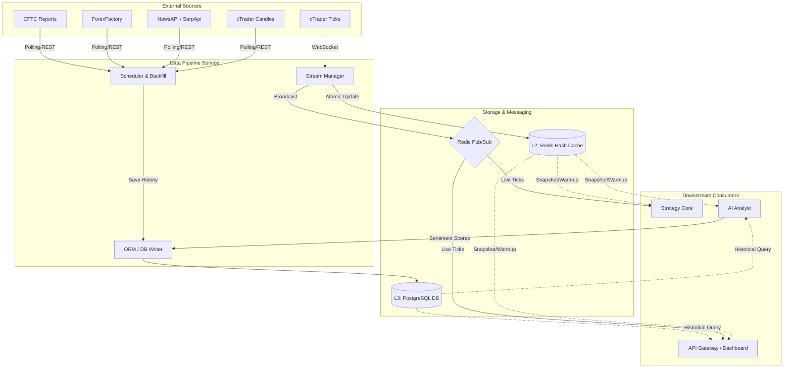

# 🚀 MTF Olympus: Data Pipeline Service

The **Data Pipeline** is the high-performance ingestion engine and "Market Awareness" layer of the MTF Olympus trading system. It handles real-time data ingestion, historical backfilling, and institutional sentiment analysis.

---

## 🏗️ Architecture Overview

The service operates as a **Stateful Producer** in a de-coupled microservices architecture:
1.  **Ingestion Layer**: Pluggable adapters (cTrader & OANDA) fetch real-time ticks and OHLC candles.
2.  **State Management (ECST)**:
    - **L1 (In-Memory)**: High-frequency candle buffers for rapid indicator calculation.
    - **L2 (Shared Cache)**: Redis Hash stores (e.g., `market_data:spot:XAUUSD`) for cross-service state sharing.
    - **L3 (Database)**: PostgreSQL handles historical candles, news articles, and COT reports.
3.  **Broadcasting**: Real-time market events are broadcasted via **Redis Pub/Sub** to downstream consumers.
    - **Ticks/Candles**: Prices and spread data.
    - **State Updates**: Broadcasts to the `state_updates` channel whenever news or market context is cached, enabling ECST for consumers like AI Analyst.
4.  **Multi-Timeframe (MTF) Support**: Native support for 8 timeframes (`M1`, `M5`, `M15`, `H1`, `H4`, `D1`, `W1`, `MN1`) with optimized `interval_map` for accurate gap detection.
5.  **Ingestion Optimization**:
    - **Reduced Payload**: Real-time candle fetching limited to latest 20 candles (previously 100) to minimize I/O and CPU load.
    - **Conditional Caching**: Redis cache updates only occur when a candle is officially closed/complete.
    - **Adaptive Throttling**: 10Hz (100ms) safety cap on price updates to prevent dashboard and network saturation during high volatility.

### 🗺️ Data Flow Architecture
The following diagram illustrates the lifecycle of data from institutional ingestion to storage and downstream consumption.



### 📰 News & Sentiment Engine
The pipeline includes a robust news ingestion and sentiment analysis framework:
- **Resilient Sourcing**: Primary hits via **NewsAPI** (optimized query mapping) with an automated fallback to **Google Search (SerpApi)** if quotas are exceeded or NewsAPI returns empty results.
- **Institutional Filtering**: Articles are filtered by **VIP Domains** (Bloomberg, Reuters, WSJ, etc.) to ensure high-quality signal generation.
- **Deduplication**: Content is normalized and deduplicated using URL-based MD5 hashing before being committed to PostgreSQL.
- **Sentiment Loop**: Receives and stores processed sentiment scores (calculated by the AI Analyst) to build long-term institutional bias charts.

---

## 🛠️ Environment Configuration

The service is configured via environment variables (see `.env` at root).

| Variable | Requirement | Description |
| :--- | :--- | :--- |
| `DATABASE_URL` | **Required** | PostgreSQL connection string. |
| `REDIS_URL` | **Required** | Redis connection (e.g., `redis://redis:6379/0`). |
| `CTRADER_TOKEN` | Optional | OAuth2 token for institucional data ingestion. |
| `SERPAPI_API_KEY` | Optional | Key for Google Search news fallback. |
| `NEWS_API_KEY` | Optional | Key for NewsAPI.org (Market sentiment). |

---

## 📡 API Documentation (v1)

### 📊 Market Data
-   `GET /api/v1/candles`: Retrieve historical OHLCV data.
-   **Tick Broadcaster (HFT-lite)**: Powers O(1) price resolution for Execution Service via Redis Pub/Sub.
-   **ECST (Event-Carried State Transfer)**: Broadcasts symbol and fund metadata to consumer caches.
-   **Stale Price Protection**: Includes millisecond timestamps for execution validity.
-   `GET /api/v1/symbols`: Get active symbols for a specific broker.
-   `POST /api/v1/backfill`: Trigger a background historical data ingestion job.

### 📰 Institutional & News
- `GET /api/v1/ingest/cot/latest`: Get latest CFTC Commitment of Traders sentiment.

#### 📊 Open Interest & Options Sentiment
- `POST /api/v1/ingest/open-interest`: Upload "Open Interest Matrix" Excel files.
- `GET /api/v1/data/open-interest/snapshots`: List available OI snapshots (Gateway proxy).
- `GET /api/v1/data/open-interest/details`: Get granular OI records (Strikes, Call/Put OI, DTE).
- `GET /api/v1/data/open-interest/analysis`: Get Put-Call Ratio (PCR) and distribution analytics.

### 🧪 System Operations
- `POST /api/v1/stream/refresh`: Force restart of real-time streaming connections.
- `POST /api/v1/ingest/manual`: Manually trigger a data ingestion cycle.
- **OI Migration/Import**:
    - `python scripts/import_oi_data.py`: Import historical Matrix files directly into the DB.
    - `bash scripts/import_oi_data.sh`: Upload local files via the API Gateway.

### 🛡️ Resilience & Throttling
- **Adaptive Throttling**: Ticker updates are capped at 100ms intervals per symbol to protect downstream WebSocket consumers.
- **Circuit Breaker (Wait)**: All internal broker requests use fixed timeouts (15s) with automated reset logic.

---

## 🤖 AI-Agent Guidance (Ops Guide)

### 🚨 Common Troubleshooting
1.  **500 Error on API**:
    - **Check Database**: Ensure migrations are current. The service runs a **Startup Dry-Run Check** (`scripts/startup_check.py`) to verify table existence.
    - **Missing Table**: If `cot_records` or `economic_events` is missing, run `alembic upgrade head`.
2.  **No Price Updates**:
    - Check if the broker (cTrader) is in **Market Closed** hours (Weekends).
    - Verify `CTRADER_TOKEN` expiry via the logs.
3.  **High Memory Usage**:
    - Check for large candle backfills running in the background.

### 🚀 Management Commands
Execute these from the project root using Docker:
```bash
# Run migrations manually
docker compose exec data-pipeline alembic upgrade head

# Perform a manual health/dry-run check
docker compose exec data-pipeline python scripts/startup_check.py

# Manually trigger a calendar sync
docker compose exec data-pipeline curl -X POST "http://localhost:8000/api/v1/news/calendar/sync"
```

## 🕰️ Historical Data Backfill (Manual)

The `data-pipeline` service provides dedicated scripts to backfill historical OHLCV candles from multiple data sources. These scripts must be executed directly inside the container and will populate the PostgreSQL `candles` table.

### 1. cTrader Backfill
Fetches trendbars from all active mapped cTrader accounts. Timeframes `M1` to `MN1`.
```bash
docker compose exec data-pipeline python scripts/backfill_ctrader_candles.py --days 30
```

### 2. OANDA Backfill
Fetches historical candles for all active Forex/CFD symbols routed to OANDA. Timeframes `M1` to `MN1`.
```bash
docker compose exec data-pipeline python scripts/backfill_oanda_candles.py --days 30
```

### 3. Binance Backfill (Crypto)
Fetches historical spot Klines strictly for `BTCUSDT` and `ETHUSDT` directly via the Binance Public API. Timeframes `M1` to `MN1`. *Automatically seeds required `DataSource` and `MarketSymbol` entries upon first run.*
```bash
docker compose exec data-pipeline python scripts/backfill_binance_candles.py --days 30
```

### 4. Yahoo Finance Backfill (Macro)
Fetches bounding historical daily (`D1`) and weekly (`W1`) data for macroeconomic indicators critical to Hybrid Predictors and FMEA Guardrails (`^VIX`, `^GVZ`, `DX-Y.NYB`, `TIP`, `^GSPC`).
```bash
docker compose exec data-pipeline python scripts/backfill_yfinance_candles.py --days 365
```

> **Note**: Backfill jobs automatically deduplicate existing records using `ON CONFLICT` style logic. They can be safely run multiple times without causing Database constraints errors.

---

## 📂 Directory Structure

```text
app/
├── adapters/          # Low-level protocol clients (Fix/Protobuf)
├── scheduler/         # Background jobs (COT, News, Backfills)
├── streaming/         # High-performance event broadcasting
├── controllers/       # Business logic for data orchestration
└── main.py            # API entry point & stream lifecycle
```

---
**MTF Olympus** | *Institutional Alpha at Scale*

## 📦 Key Components
-   `app/adapters/`: Low-level protocol clients (Fix/Protobuf for cTrader).
-   `app/scheduler/`: Background jobs for non-realtime data (COT, News).
-   `app/streaming/`: High-performance broadcast management.
-   `scripts/entrypoint.sh`: Orchestrates migrations and dry-runs on startup.
