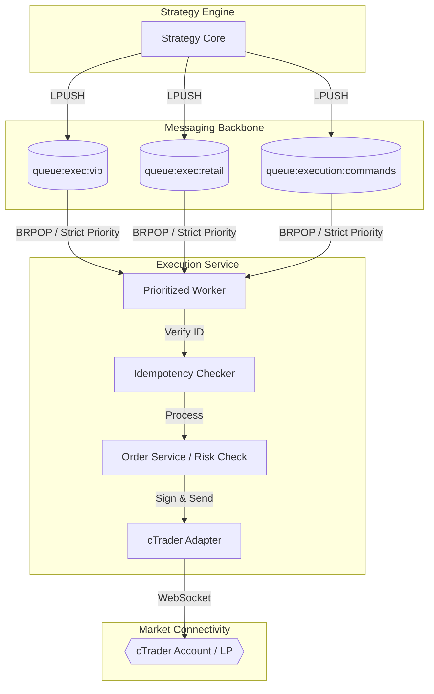

# MTF Olympus: Execution Service

The **Execution Service** is the institutional mandate-processor of the MTF Olympus platform. It handles the critical bridge between internal analytical signals and live broker execution, specifically optimized for **cTrader** via high-throughput WebSocket communication.

## 🏗️ Async RPC Architecture

The service operates as an autonomous background consumer, decoupling strategy logic from execution latency via a prioritized Redis-based "Buffer & Fire" model.



## 🎯 Core Responsibilities

- **Async Command Processing**: Distributed consumption of trade signals with strict priority weighting (VIP > Retail > Standard).
- **Institutional cTrader Adaption**: High-fidelity orders (Market, Limit, Stop) with integrated Stop-Loss and Take-Profit tagging.
- **Idempotency & Safety**: Multi-layer protection against race conditions using Redis `SETNX` locking to ensure a signal is never executed twice.
- **Dead Letter Handling**: Automated retry logic (3 attempts) with routing to `queue:exec:dead` for manual intervention on failed orders.
- **Equity Guardian**: Real-time monitoring of account equity and margin availability to enforce hard system-wide circuit breakers.

## 🤖 AI-Agent Operational Guide

To modify execution behavior or troubleshoot connectivity, follow this path:

1.  **Command Flow**: The main consumer loop is in `app/worker.py`.
2.  **Broker Adapters**: The cTrader logic resides in `app/adapters/ctrader.py` and `app/adapters/ctrader_client.py`.
3.  **Risk Logic**: Final pre-execution risk checks are performed in `app/executor.py`.
4.  **Minimax Integration**: Portfolio risk parity and regret minimizing logic is in `app/services/minimax_service.py`.

## 🚦 Operational Guide

### Common Issues & Fixes

| Symptom | Probable Cause | Fix |
| :--- | :--- | :--- |
| **Orders Stuck in Queue** | Worker is down or Redis full | Check `docker ps`; verify `EXECUTION_MAX_QUEUE_SIZE` in Strategy Core. |
| **cTrader Connection Error** | OAuth token expiry or network | Check logs for "ProtoOAAuthenticateRes"; verify connectivity to `proxy.ctrader.com`. |
| **Idempotency Reject** | Duplicate signal delivery | Normal behavior (Signal protection); investigate why Strategy Core is double-firing. |

### Diagnostic CLI
Check worker health and current queue depths:
```bash
docker compose exec execution python -c "from app.health import check_queues; print(check_queues())"
```

## 📂 Directory Structure

```text
app/
├── adapters/          # Broker protocols (cTrader WebSocket, Binance, OANDA)
├── services/          # Business logic (Order Management, Minimax Risk, Equity Guardian)
├── core/              # Global schemas & configuration managers
├── executor.py        # Final risk-parameter calculation & validation
├── worker.py          # Prioritized Redis queue consumer (The Heart)
└── main.py            # API entry point & background task orchestration
```

## 🛠️ Multi-Broker Support
While **cTrader** is the primary institutional target, the service maintains a pluggable `BrokerFactory` for:
- **Binance**: Crypto spot/futures execution.
- **Mock**: For isolated testing environments.

---
**MTF Olympus** | *Institutional Alpha at Scale*
