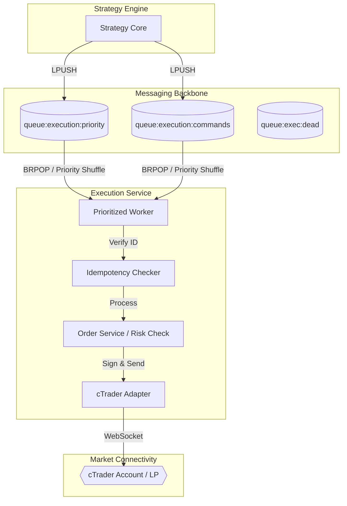

# MTF Olympus: Execution Service

The **Execution Service** is the institutional mandate-processor of the MTF Olympus platform. It handles the critical bridge between internal analytical signals and live broker execution, specifically optimized for **cTrader** via high-throughput WebSocket communication.

## 🏗️ Async RPC Architecture

The service operates as an autonomous background consumer, decoupling strategy logic from execution latency via a prioritized Redis-based "Buffer & Fire" model.



### 🛡️ Institutional Normalization Algorithm (cTrader/IC Markets)

To ensure zero-math drift across disparate asset classes (Gold vs. Forex), the service enforces a strict normalization pipeline:

1. **Signal Ingest**: Receives `units` from Strategy Core (e.g., 5000 units).
2. **Metadata Lookup**: Fetches `(symbol_id, lot_size_cents, step_cents, digits)` from L3 Cache.
   - *Example (IC Markets Gold)*: `lot_size_cents=10000000`, `digits=2`, `step_cents=100`.
3. **Volume Conversion**: `volume_cents = internal_units * (broker_lot_size_cents / 100,000)`.
   - *Result*: 5000 units → 500,000 cTrader volume cents (rounded to 1 unit step).
4. **Price Rounding**: All SL/TP prices are rounded to `digits` (e.g., `round(2150.1234, 2)` → `2150.12`).
5. **Execution**: Sends Protobuf `ProtoOANewOrderReq` with absolute rounded prices and normalized volume.
6. **Fill Routing**: Receives `volume` from `ExecutionEvent`, converts back via `UnitConverter.ctrader_volume_to_internal_units` for DB persistence.

## 🎯 Core Responsibilities

- **HFT-lite Execution Core**: Non-blocking, parallel risk validation with <100ms latency targets.
- **Tiered Caching**: Multi-level cache (In-memory + Redis) for accounts, funds, and decrypted credentials.
- **Sub-millisecond Price Resolution**: Direct-to-Redis price lookups with stale price protection.
- **Observability Tracing**: Millisecond-level execution tracing for performance auditing and bug detection.
- **Risk Citadel**: 6+ layers of automated risk filters (News, Volatility, Liquidity, etc.).
- **Async Command Processing**: Distributed consumption of trade signals with professional priority weighting (**Priority** > **Standard**).
- **Institutional cTrader Adaption**: High-fidelity orders (Market, Limit, Stop) with integrated Stop-Loss and Take-Profit tagging.
- **Idempotency & Safety**: Multi-layer protection against race conditions using Redis `SETNX` locking to ensure a signal is never executed twice.
- **Dead Letter Handling**: Automated retry logic (3 attempts) with routing to `queue:exec:dead` for manual intervention on failed orders.
- **Hierarchical Risk Citadel (3-Phase)**: Modular validation engine enforcing:
    - **Phase 1 (Core)**: Flexible SL/TP (optional), distance, and RRR validation. Support for Market, Limit, and Stop orders with integrated slippage protection.
    - **Phase 2 (Market)**: Real-time News, Session, Volatility, Quant, and Liquidity filters synced via Redis for HFT speeds.
    - **Phase 3 (Account)**: Daily Drawdown, Max Trades, and Consecutive Loss limits.
- **Equity Guardian**: Real-time monitoring of account equity and margin availability to enforce hard system-wide circuit breakers. Dynamically refreshes thresholds on AI-driven risk rebalancing events.
- **Institutional Resilience**: Professional-grade **Circuit Breakers** for broker connections, request **Timeouts** (15-30s), and a **Global Kill Switch** for emergency halts.
- **HFT-Lite Latency Suite**:
    - **TCP_NODELAY**: Immediate packet transmission (disabled Nagle's).
    - **Latency Tracing**: Automatic timestamping of `Signal -> Fill` round-trips.
    - **Comprehensive L3 Adapter Cache**: DB-hydrated in-memory symbol and contract mapping for sub-millisecond execution resolution.
    - **[P58] Institutional "Zero-Math" Normalization**: Centralized all unit, lot, and risk math into `UnitConverter`. Services no longer perform ad-hoc math; they consume standardized units (100,000 internal units = 1.0 Standard Lot).
    - **Connection Warm-up**: Proactive broker session initialization.
- **🛡️ Shadow Trading Support**:
    - **Status**: (Planned) `is_shadow` flag in deployment config.
    - **Behavior**: Processes full risk and logic path but bypasses the `BrokerAdapter` send call. Logs "Simulated Fills" for slippage analysis.
- **🛡️ Sprint F Safety Guards** (implemented):
    - **Pre-trade Risk Validation**: SL/TP direction check in `amend_order` — LONG SL must be below entry, SHORT SL above. Violations return HTTP 422.
    - **`RiskValidationError`**: Custom exception class distinct from `ValueError` (404) to enable correct HTTP status codes.
    - **15 unit tests** covering all validation paths.
- **✅ Phase 1 — OANDA Live Integration** (Implemented):
    - **[O1] Live Environment Support**: Dedicated `OandaOrderAdapter` with `v20` API integration.
    - **[O2] Bracket Orders**: Automated SL/TP attachment to both Market and Limit orders.
    - **[O3] Order Amendment**: Support for `OrderReplace` to dynamically move Entry, SL, and TP on pending orders.
    - **[O4] Resilient Sync**: Validated against OANDA state sync delays with human-like simulation testing.
- **✅ Phase 15 — cTrader ID Stabilization** (Complete 2026-03-10):
    - **Stable ID Mapping**: Prioritizes `positionId` over `orderId` for filled market orders, ensuring persistent trade records align with broker requirements for amendments.
    - **Duplicate Prevention**: Re-engineered event filtering to skip `ORDER_ACCEPTED` and only publish true fill data.
    - **Deal Tracking**: Implemented `broker_deal_id` for robust deduplication across service boundaries.
    - **Reconciliation Enhancement**: Updated Janitor sync to include Pending Orders, preventing accidental pruning of working limit/stop orders.
    - **Priority Verification**: Confirmed sub-10ms processing of `priority` queue vs `commands` queue under load.
- **✅ Rule 7 — Hot Path Isolation** (Phase 28 Complete 2026-03-11):
    - **DB-Free Execution**: Eliminated all blocking database writes from the order placement and confirmation path.
    - **Async Fill Persistence**: Implemented Redis Streams for decoupled trade journaling.
    - **Passive Latency Auditing**: Integrated `baseline_latency_analyzer.py` for continuous compliance verification.
- **✅ Phase 56 — Automated Drawdown Enforcement** (Complete 2026-03-19):
    - **[P56-1] Hard Stop Monitoring**: Integrated real-time drawdown tracking in `EquityGuardian` with automated trade closure.
    - **[P56-2] Granular Halt Enforcement**: `OrderService` now blocks orders based on fund-specific Redis kill-switches.
- **✅ Phase 57 — AI-Driven Risk Rebalancer** (Complete 2026-03-19):
    - **[P57-1] Internal Risk Config Endpoint**: `GET /funds/{fund_id}/risk-config` — provides direct DB access for AI Analyst (bypasses Gateway to avoid reentrant deadlocks).
    - **[P57-2] Dynamic Threshold Refresh**: `EquityGuardian` now listens for `RISK_REBALANCE_APPLIED` events on Redis `system:events` channel and invalidates its threshold cache, forcing a fresh DB read on the next analysis cycle.
- **✅ Phase 58 — Institutional "Zero-Math" & cTrader Metadata** (Complete 2026-03-20):
    - **[P58-1] Universal Unit Standard**: Enforced **100,000 units = 1.0 Standard Lot** system-wide. All adapters (cTrader, OANDA) must normalize volume via `UnitConverter`.
    - **[P58-2] 4-Tuple Symbol Cache**: Upgraded cTrader L3 cache to `(symbol_id, lot_size_cents, step_cents, digits)`. This enables precise risk calculation and price rounding for complex assets like **Gold (XAU/USD)** and **Crypto**, specifically optimized for brokers like **IC Markets**.
    - **[P58-3] Resilient Sync & Fill**: Refactored `SyncService` and `FillTradeConsumer` to use standardized lot scaling, ensuring DB-Broker parity.
    - **[P58-4] Shadowing Fixes**: Resolved Python scoping (UnboundLocalError) and shadowing issues in `ctrader.py` to ensure high-concurrency event processing.

## 🤖 AI-Agent Operational Guide

To modify execution behavior or troubleshoot connectivity, follow this path:

1.  **Command Flow**: The main consumer loop is in `app/worker.py`.
2.  **Broker Adapters**: The cTrader logic resides in `app/adapters/ctrader.py` and `app/adapters/ctrader_client.py`.
3.  **Modular Filters**: Phase 2 market filters are in `app/filters/`.
4.  **Risk Management**: Account-level limits (Phase 3) are in `app/risk/risk_limits.py`.
5.  **Minimax Integration**: Portfolio risk parity and regret minimizing logic is in `app/services/minimax_service.py`.

## 🚦 Operational Guide

### Common Issues & Fixes

| Symptom | Probable Cause | Fix |
| :--- | :--- | :--- |
| **Orders Stuck in Queue** | Worker is down or Redis full | Check `docker ps`; verify `EXECUTION_MAX_QUEUE_SIZE` in Strategy Core. |
| **cTrader Connection Error** | OAuth token expiry or network | Check logs for "ProtoOAAuthenticateRes"; verify connectivity to `proxy.ctrader.com`. |
| **cTrader Cancel Reject (2132)**| Order status mismatch or expiry | Normal cTrader API behavior for stale orders; check if order already filled. |
| **Idempotency Reject** | Duplicate signal delivery | Normal behavior (Signal protection); investigate why Strategy Core is double-firing. |

### Diagnostic CLI
Check worker health and current queue depths:
```bash
docker compose exec execution python -c "from app.health import check_queues; print(check_queues())"
```

## 📂 Directory Structure

```text
app/
├── adapters/          # Broker protocols (cTrader WebSocket, Binance, OANDA)
├── filters/           # Modular Phase 2 market condition filters (Redis-context aware)
├── risk/              # Phase 3 Account-level risk agents (Drawdown, Limits)
├── services/          # Business logic (Order Management, Minimax Risk, Equity Guardian)
├── validators/        # Phase 1 Core order parameter validation
├── core/              # Global schemas & configuration managers
├── executor.py        # Final risk-parameter calculation & validation
├── worker.py          # Prioritized Redis queue consumer (The Heart)
└── main.py            # API entry point & background task orchestration
```

## 🛠️ Multi-Broker Support
While **cTrader** is the primary institutional target, the service maintains a pluggable `BrokerFactory` for:
- **Binance**: Crypto spot/futures execution.
- **Mock**: For isolated testing environments.

---
**MTF Olympus** | *Institutional Alpha at Scale*
