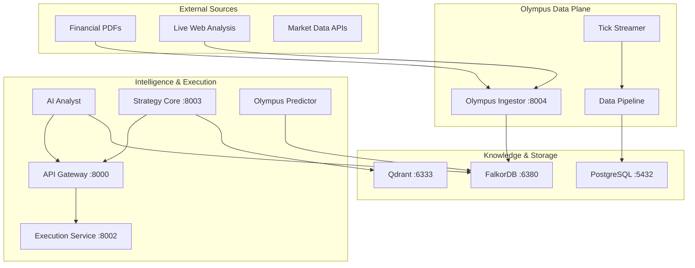

# Olympus Agentic Ingestor 🚀

[](https://www.python.org/downloads/release/python-3120/)
[](https://github.com/astral-sh/uv)
[](https://pytest.org)

Professional-grade agentic pipeline for ingesting complex financial research into **FalkorDB** knowledge graphs.

## 🌟 Key Features

- **Professional Structure**: Modularized as the `app` package.
- **Hybrid Ingestion & Enrichment**: 
  - **Static Extraction**: Advanced OCR/PDF extraction via `pypdf`.
  - **Live Verification**: Integrated `MarketReaderTool` for real-time asset price validation (Yahoo Finance).
- **Dual-Mode Ingestion**:
  - **Standard**: Fast, linear processing for smaller files.
  - **Hierarchical**: 3-tier recursive processing (Summary, Detail, Conclusion) for large research papers.
- **Real-time SSE Streaming**: Asynchronous ingestion progress tracking and token-by-token LLM responses via Server-Sent Events.
- **Cascading LLM Architecture**: 3-tier fallback logic (Gemini 2.5 Pro → Flash → GPT-4o) ensuring high availability and cost optimization.
- **Agentic Pipeline**: Planner, Architect, and Committer agents working in sync.
- **82%+ Test Coverage**: Robust suite using `pytest` with comprehensive mocking (LLM, Redis, FS).
- **Modern Tooling**: Powered by `uv` for lightning-fast dependency management and Python 3.12.

---

## 🚀 Quick Start

### 1. Requirements & Setup
Ensure you have [uv](https://astral.sh/uv/) installed.

```bash
# Sync environment and dependencies
uv sync
```

### 2. Run Ingestion
Place your files in `source_data/` and run the unified CLI:
## Quick Start (Production Service)

Project Olympus now runs as a high-performance FastAPI service.

### 1. Start the Service
```bash
docker-compose up --build -d
```
The service will be available at [http://localhost:8000](http://localhost:8000).

### 2. Access API Documentation
Visit [http://localhost:8000/docs](http://localhost:8000/docs) for the interactive Swagger UI.

### 3. Trigger Ingestion via API
```bash
# Returns a task_id immediately
curl -X POST "http://localhost:8000/ingest" -F "file=@source_data/my_report.pdf"
```

### 4. Monitor Progress (Real-time)
```bash
# Stream ingestion events (queued, processing, completed)
curl -N "http://localhost:8000/stream/status/{task_id}"
```

## Core Features

- **Hybrid Ingestion**: Static PDF analysis + Real-time Market Data + Web Intelligence.
- **WebScout Agent**: Automated live web discovery using DuckDuckGo.
- **Startup Guard**: Automated infrastructure validation on boot.
- **Structured Logging**: JSON logs for professional production monitoring.
- **SSE Streaming**: Native support for `EventSource` in the frontend for live pipeline heartbeats.

---

## 📂 Project Structure

```text
app-ingestor/
├── app/                # Core Package logic
│   ├── core/               # Shared utils (config, llm, models)
│   ├── ingestors/          # Specialized pipelines (Standard, Hierarchical)
│   ├── tools/              
│   │   ├── falkordb_client.py   # Database connectivity
│   │   └── market_reader.py     # Real-time data enrichment tool
│   └── ...
├── tests/                  # 82%+ Coverage test suite
├── scripts/                # Utility & maintenance scripts
├── source_data/            # Input area (archive/ and errors/ subdirs)
├── ingest.py               # Unified CLI entry point
├── pyproject.toml          # uv & pytest configuration
└── WORKFLOWS.md            # Detailed developer usage examples
```

---

## 🛠️ Configuration

Settings are managed via `.env` (automatically loaded by `AppConfig`):

| Variable | Description | Default |
|----------|-------------|---------|
| `OPENROUTER_API_KEY` | API Key for LLM access | Required |
| `FALKOR_HOST` | FalkorDB (Redis) host | `localhost` |
| `FALKOR_PORT` | FalkorDB (Redis) port | `6380` |
| `GRAPH_NAME` | Target Knowledge Graph | `OlympusKnowledgeGraph` |

---

## 📊 Ingestion Capabilities

| File Type | Description |
|-----------|-------------|
| `.md` | Markdown (Optimized for Hierarchical Tiering) |
| `.json` | Structured data extraction |
| `.csv` | Tabular data with auto-truncation logic |
| `.pdf` | Financial reports & PDFs (via `pypdf`) |
| `.txt` | Plain text analysis |

---

## 🧠 Architecture: MTF Trading System Ecosystem

The **Olympus Ingestor** is a critical component of the broader **MTF Trading System**, responsible for transforming unstructured research into actionable intelligence.

### Full System Architecture



### System Context & Connectivity

| Service | Port | Role |
|---------|------|------|
| **API Gateway** | `8000` | Central entry point for all MTF services. |
| **Olympus Ingestor** | `8004` | Agentic ingestion for FalkorDB Knowledge Graphs. |
| **Strategy Core** | `8003` | Quantitative strategy execution logic. |
| **Execution Service** | `8002` | Order management and exchange connectivity. |
| **FalkorDB** | `6380` | High-performance graph database for financial intelligence. |
| **PostgreSQL** | `5432` | Relational storage for time-series and transaction data. |

---

---

## ⚠️ Market Data Risks & Improvements

The current auto-refresh price system relies on **Yahoo Finance (Public API)**, which involves certain risks and limitations:

### Risks
- **Accuracy & Latency**: Public API data can be delayed or inaccurate during periods of high market volatility.
- **Ticker Mismatch**: Incorrect ticker mapping can occur if asset names are ambiguous (e.g., "Oil" vs. "Crude Oil").
- **Service Availability**: Public endpoints are subject to rate limiting or sudden changes in availability by the provider.

### Future Improvements (Roadmap for Contributors/AI Agents)
- **Professional Data Providers**: Integrate stable, low-latency APIs such as Bloomberg, Refinitiv, or Alpha Vantage (Premium).
- **Fallback Logic**: Implement multi-source redundancy to ensure data availability when primary sources fail.
- **Enhanced Validation**: Use LLM-based ticker validation to dynamic map ambiguous names to canonical tickers.
- **Caching Layer**: Optimize Redis-backed caching to minimize external API calls and improve performance.

---

## 🛡️ Resident Safety: Startup Guard

The ingestor includes a professional **StartupGuard** that prevents "Silent Failures". On boot, it validates:
- **Redis/FalkorDB Connectivity**: Ensures the graph store is reachable.
- **LLM Gateway (OpenRouter)**: Validates API keys and model availability.
- **Filesystem Integrity**: Confirms write permissions for `source_data/`, `archive/`, and `errors/`.
- **Logger Configuration**: Optimized structured logging with corrected `structlog` endpoints.

---
*Last updated: 2026-03-09*
