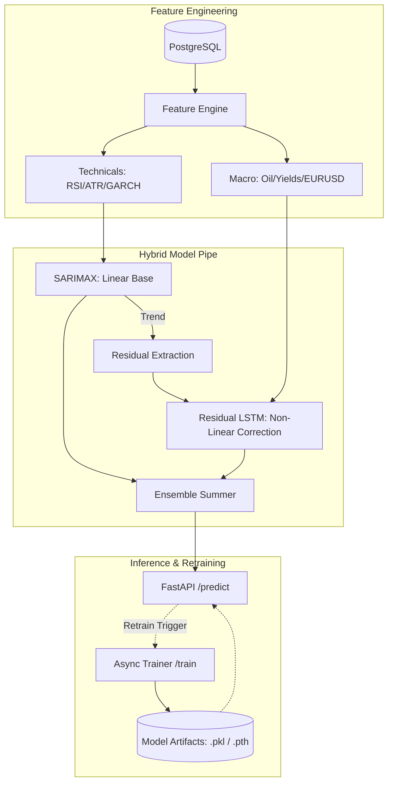

# MTF Olympus: Olympus Predictor

The **Olympus Predictor** is the quantitative forecasting engine of the MTF Olympus platform. It utilizes a sophisticated **Hybrid Ensemble-Residual Architecture** to bridge classical econometrics with deep learning, providing high-fidelity price and volatility projections for XAU/USD (Gold).

## 🔬 Hybrid ML Architecture

The system operates on a two-stage forecasting paradigm to maximize both explainability and non-linear capture.



## 🎯 Core Capabilities

- **Hybrid Forecasting**: Combines **SARIMAX** (Linear Trend) with **Residual LSTM** (Stochastic Volatility & Non-linear noise) to reduce Mean Absolute Percentage Error (MAPE).
- **Institutional Feature Engine**: Automated calculation of GARCH(1,1) volatility, ATR, and RSI, aligned with institutional macro indicators.
- **Boruta Feature Selection**: Dynamically identifies the most significant exogenous drivers per training cycle to prevent overfitting.
- **Residual Correction Layer**: The LSTM specifically targets the *errors* of the SARIMAX model, capturing regime shifts that classical models miss.
- **Asynchronous Retraining**: Model updates are executed via FastAPI `BackgroundTasks`, ensuring zero-downtime inference.

## 🤖 AI-Agent Operational Guide

To modify the forecasting logic or retrain models, follow this path:

1.  **Ensemble Logic**: The hybrid piping is managed in `app/model_engine.py`.
2.  **Feature Extraction**: Technical indicators and GARCH calculations are in `app/feature_engine.py`.
3.  **Data Hydration**: Database and Redis interaction maps are in `app/data_loader.py`.
4.  **Schema Enforcement**: Prediction request/response structures are in `app/schemas.py`.

## 🚦 Operational Guide

### Common Issues & Fixes

| Symptom | Probable Cause | Fix |
| :--- | :--- | :--- |
| **503: Model Not Trained** | Missing artifacts in `/app/models` | Trigger a manual training cycle via `POST /api/v1/olympus/train`. |
| **Prediction Drift** | Regime shift in market volatility | Check GARCH(1,1) parameters; increase training frequency. |
| **Missing Macro Data** | Data-Pipeline sync error | Verify `macro_data` table in PostgreSQL; ensure Data-Pipeline is healthy. |

### Model Management
Models are persisted in the `/app/models` volume. Key artifacts include:
- `sarimax_xau.pkl`: Linear base weights.
- `lstm_residual.pth`: PyTorch weights for non-linear correction.
- `scaler.pkl / exog_scaler.pkl`: Normalization constants.

## 📂 Directory Structure

```text
app/
├── models/            # Persistent storage for trained artifacts (.pkl, .pth)
├── feature_engine.py  # Technical indicator & GARCH calculation logic
├── model_engine.py    # Hybrid Ensemble orchestrator (SARIMAX + LSTM)
├── data_loader.py     # Multi-source data hydration (SQL + Redis)
├── schemas.py         # Pydantic models for inference validation
└── main.py            # API entry point & async task management
```

---
**MTF Olympus** | *Institutional Alpha at Scale*
