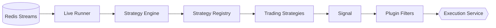

# MTF Olympus: Strategy Core Service

The **Strategy Core** is the high-performance analytical engine and execution hub of the MTF Olympus trading system. It is responsible for real-time market analysis, strategy orchestration, backtesting, and institutional-grade indicator calculations.

## 🚀 Overview

Strategy Core transforms raw market data into actionable trading signals using a decoupled, event-driven architecture. It supports both predefined "Institutional Templates" and dynamic, user-coded bots, all while maintaining a low-latency execution pipeline.

### Key Capabilities:
- **Real-Time Async Execution**: Ultra-low latency `LPUSH` message queue via Redis for non-blocking execution with Circuit Breakers.
- **Vectorized Backtesting**: High-speed historical simulations leveraging [VectorBT](https://vectorbt.dev/).
- **Institutional Indicators**: Numba-accelerated implementations of Market Profile (TPO), SMC, and Multi-Timeframe Pivots.
- **Dynamic Risk Engine**: HFT-optimized `PositioningEngine` utilizing Fractional Kelly Criterion (bounded edge sizing) with cached hierarchical limits.
- **Extensible Plugin System**: A hook-based architecture (Actions & Filters) for risk filters, sentiment guards, and notifications.
- **MTF Awareness**: Native support for Multi-Timeframe analysis (M1 to Monthly).

## 🏗️ Architecture

The service is built with **FastAPI** and utilizes a multi-layered design:

- **API Layer (`main.py`)**: Exposes analytical tools and lifecycle management endpoints.
- **Strategy Engine (`app/engine/`)**: The core orchestrator managing state, events, and signal generation.
- **Fleet Manager (`app/fleet.py`)**: Scales strategy deployments across multiple symbols and accounts.
- **Registry (`app/registry.py`)**: Dynamically discovers and loads specialized strategy modules.
- **Plugin Engine (`app/plugins/`)**: Decouples cross-cutting concerns (Risk, AI Sentiment) from core strategy logic.

### Data Flow


## 🛠️ Components

### 1. Market Profile & SMC
The `app/indicators` directory contains top-tier analytical tools:
- **TPO Profile**: Optimized with Numba for sub-20ms performance on large datasets.
- **SMC Engine**: Vectorized detection of Order Blocks, Fair Value Gaps (FVG), and Liquidity Sweeps.
- **MTF Pivots**: Support for Camarilla, Woodie, and Traditional levels across all timeframes.

### 2. Strategy Fleet
The **Fleet Manager** handles the lifecycle of:
- **Template Strategies**: Hardcoded institutional logics used for consistency.
- **Dynamic Bots**: User-provided Python code executed in a sandboxed environment (`DynamicBotExecutor`).

### 3. Plugin System
Leverages a WordPress-inspired `HookManager` to allow modular extensions:
- `on_market_data`: Enrich or filter incoming data.
- `filter_signal`: Apply global risk or sentiment constraints.
- `on_signal`: Trigger external notifications (Telegram, Webhooks).

### 4. Risk & Execution (Institutional Grade)
- **Async Execution Queue**: Strategy Core operates as a pure publisher. Signals are injected into `queue:execution:commands` with Idempotency Keys (UUID) to strictly prevent race conditions.
- **Circuit Breaker**: Drop mechanisms kick in if queue depths exceed safe limits, preventing slippage.
- **Kelly Criterion Positioning**: The `PositioningEngine` sizes positions dynamically using `W - ((1 - W) / R)` derived from `last_backtest_result`, safeguarded by a Half-Kelly fraction and cached Fund/Account hard limits.

### 5. Standardized Market Data Paradigm (High-Frequency)
A "Buffer-First" architecture optimized for <100µs latency:
- **`SharedMarketDataManager`**: Uses O(1) `deque` buffers for tick ingestion and M1 candle storage.
- **Lazy Synthesis**: DataFrames are built only on demand via `get_candles(symbol, timeframe)`.
- **Standard API**: All strategies **MUST** use the following pattern for MTF access:
  ```python
  # Correct Usage
  df_h1 = data_manager.get_candles(symbol, "1h")
  df_m5 = data_manager.get_candles(symbol, "5min")
  ```

## 🚦 API Reference (Highlights)

| Endpoint | Method | Description |
| :--- | :--- | :--- |
| `/api/v1/calculate/smc` | `POST` | Get SMC analysis for a given dataset. |
| `/api/v1/calculate/market-profile` | `POST` | Generate TPO profile & POC/VAH/VAL. |
| `/api/v1/backtest` | `POST` | Run a vectorized historical backtest. |
| `/api/v1/strategies/{id}/start` | `POST` | Activate a live strategy instance. |
| `/api/v1/analysis/drift` | `GET` | Calculate system rejection and slippage rates. |

## 📦 Installation & Development

This service uses `uv` for lightning-fast dependency management.

### Prerequisites:
- Python 3.12+
- Redis (running on `localhost:6379`)
- PostgreSQL

### Local Setup:
```bash
# Install dependencies
uv sync

# Run the service with hot-reload
uv run uvicorn app.main:app --reload --port 8001
```

### Testing:
```bash
# Run unit and contract tests
uv run pytest
```

---
**MTF Olympus** | *Institutional Alpha at Scale*
