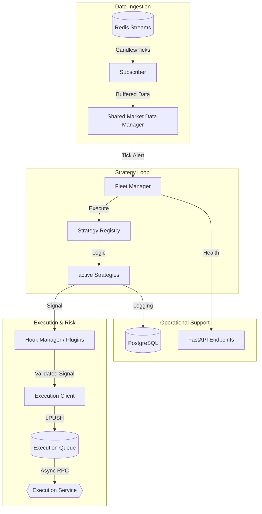

# MTF Olympus: Strategy Core

The **Strategy Core** is the high-performance analytical engine and orchestration hub of the MTF Olympus trading system. It transforms raw market data into institutional-grade signals using vectorized analysis, Smart Money Concepts (SMC), and a dynamic minimax risk engine.

## 🏗️ Technical Architecture

The service operates on a "Buffer-First" reactive model, decoupling analysis from execution via Redis-based Async RPC.



## 🎯 Core Responsibilities

- **MTF Signal Generation**: Native Multi-Timeframe (M1 to Monthly) analysis with sub-millisecond strategy switching.
- **Institutional Indicators**: Numba-accelerated implementations of **SMC** (Order Blocks, FVG), **TPO (Market Profile)**, and **Gamma Exposure**.
- **Dynamic Risk Sizing**: Real-time position sizing based on Fractional Kelly Criterion and Fund-level risk parity.
- **Hook-based Extensibility**: Modular "WordPress-style" plugin system for risk filters, sentiment guards, and notifications.

## 🔧 Component deep-dive

### 1. The Strategy Fleet (`app/fleet.py`)
Manages the lifecycle of live strategies. It identifies which strategies need to re-calculate based on incoming symbols and timeframes, preventing redundant compute.

### 2. Indicator Engine (`app/indicators/`)
All indicators are optimized using **Numba JIT**. 
> [!NOTE]  
> The first execution of an indicator (e.g., after service restart) may experience a "JIT warm-up" delay of 1-3 seconds. Subsequent calls are near-instant (<10ms).

### 3. Plugin Hooks (`app/plugins/`)
The `HookManager` allows external injection into the trading loop:
- `on_market_data`: Enrich data before strategies see it.
- `filter_signal`: Final veto power for Risk/AI Sentiment plugins. [See: api-agent-guardrails skill]

## 🚦 Operational Guide

### Common Issues & Fixes

| Symptom | Probable Cause | Fix |
| :--- | :--- | :--- |
| **Strategy Hangs** | Deadlock in `market_data_manager` lock | Restart service; check Redis Stream depth. |
| **High Latency** | Redis Queue backup | Increase `EXECUTION_MAX_QUEUE_SIZE` or scale Execution Worker. |
| **Missing Signals** | ATR/Volatility filter veto | Check `opportunity_log` table for rejection reason. |

### Circuit Breakers
The service will automatically drop trade commands if the `queue:execution:commands` length exceeds **50** (configurable via `EXECUTION_MAX_QUEUE_SIZE`) to prevent executing on stale price data.

## 🤖 AI-Agent Operational Guide

To understand or modify strategy behavior, follow this priority path:

1.  **Logic Definition**: Consult `specs/08_logic_rules.yaml` for the theoretical rules.
2.  **Implementation**: Check `app/strategies/` for the actual Python implementation.
3.  **Registration**: Verify the strategy is registered in `app/registry.py`.
4.  **Logging**: Query the `signal_log` and `opportunity_log` tables in PostgreSQL to track why signals were generated or blocked.

## 📂 Directory Structure

```text
app/
├── adapters/          # External service clients (OANDA, cTrader, AI)
├── engine/            # Strategy execution & state orchestration
├── indicators/        # Numba-optimized analytics (SMC, TPO, Pivots)
├── plugins/           # Hook-based modular extensions (Risk/Sentiment)
├── registry.py        # Strategy discovery and loading logic
└── main.py            # API entry point & engine lifecycle
```

---
**MTF Olympus** | *Institutional Alpha at Scale*
