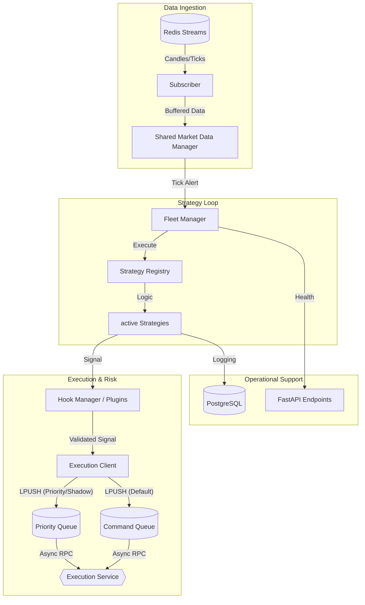

# MTF Olympus: Strategy Core

The **Strategy Core** is the high-performance analytical engine and orchestration hub of the MTF Olympus trading system. It transforms raw market data into institutional-grade signals using vectorized analysis, Smart Money Concepts (SMC), and a dynamic minimax risk engine.

## 🏗️ Technical Architecture

The service operates on a "Buffer-First" reactive model, decoupling analysis from execution via Redis-based Async RPC.



## 🎯 Core Responsibilities

- **MTF Signal Generation**: Native Multi-Timeframe (M1 to Monthly) analysis with sub-millisecond strategy switching.
- **Institutional Indicators**: Numba-accelerated implementations of **SMC** (Order Blocks, FVG, IDM), **TPO (Market Profile)**, and **Gamma Exposure**.
- **Market Context Broadcast**: Dedicated background worker for publishing real-time **PIV**, **Quant Risk**, and **Liquidity** snapshots to Redis for HFT-latency execution.
- **Dynamic Risk Sizing**: Real-time position sizing based on Fractional Kelly Criterion and Fund-level risk parity.
- **Hook-based Extensibility**: Modular "WordPress-style" plugin system for risk filters, sentiment guards, and notifications.
- **Prioritized Execution**: Unified `ExecutionClient` that automatically routes Close/Modify/Cancel commands to the priority queue for immediate action.

## 🔧 Component deep-dive

### 1. The Strategy Fleet (`app/fleet.py`)
Manages the lifecycle of live strategies. It identifies which strategies need to re-calculate based on incoming symbols and timeframes, preventing redundant compute.

### 2. Indicator Engine (`app/indicators/`)
All indicators are optimized using **Numba JIT**. 
> [!NOTE]  
> The first execution of an indicator (e.g., after service restart) may experience a "JIT warm-up" delay of 1-3 seconds. Subsequent calls are near-instant (<10ms).

### 3. Plugin Hooks (`app/plugins/`)
The `HookManager` allows external injection into the trading loop:
- `on_market_data`: Enrich data before strategies see it.
- `filter_signal`: Final veto power for Risk/AI Sentiment plugins. [See: api-agent-guardrails skill]

## 💎 World-Class Strategy Features (v2.8)
This service provides institutional-grade quantitative analysis tools:

*   **Vectorized Strategy Engine**: High-performance backtesting using `vectorbt` via `VectorizedStrategyBase`.
*   **Enhanced Monte Carlo**: Bootstrap-based resampling with confidence bands and ruin probability calculation.
*   **Portfolio Optimization**: Hierarchical Risk Parity (HRP) and Risk Parity weighting via `PyPortfolioOpt`.
*   **Minimax Regret Risk Filter**: Intelligent signal filtering using Game Theory to identify high-conviction trades.
*   **Walk-Forward Analysis (WFA)**: Automated robustness testing with Out-Of-Sample (OOS) validation.

## 🚦 Institutional Strategy Lifecycle
All strategies deployed in this service MUST follow the **7-Step Olympus Standard**:
1. **SDD Spec**: Rules defined in `specs/08_logic`.
2. **Backtest**: Vectorized validation via `vectorbt`.
3. **Monte Carlo**: `app/analysis/monte_carlo.py` (Ruin Prob < 1%).
4. **Walk-Forward**: Out-of-Sample verification (Score > 60%).
5. **JSON Mapping**: 1:1:1 Strategy -> Fund -> Account.
6. **Shadow Trading**: Run live but `is_shadow=True` (No broker calls).
7. **Drift Monitor**: Continuous health check via `PerformanceMonitor`.

## 🚦 Operational Guide

### Common Issues & Fixes

| Symptom | Probable Cause | Fix |
| :--- | :--- | :--- |
| **Strategy Hangs** | Deadlock in `market_data_manager` lock | Restart service; check Redis Stream depth. |
| **High Latency** | Redis Queue backup | Increase `EXECUTION_MAX_QUEUE_SIZE` or scale Execution Worker. |
| **Missing Signals** | ATR/Volatility filter veto | Check `opportunity_log` table for rejection reason. |

### Circuit Breakers
The service utilizes a professional-grade circuit breaker in the `ExecutionClient`:
- **Default Queue**: Orders are dropped if `queue:execution:commands` exceeds **100** commands.
- **Priority Queue**: Critical commands (Close/Modify) are allowed up to **200** entries before dropping.
- **Global Kill Switch**: Monitors Redis `system:kill_switch`. If active, all new signal generation and order placement is suspended.

## 🤖 AI-Agent Operational Guide

To understand or modify strategy behavior, follow this priority path:

1.  **Logic Definition**: Consult `specs/08_logic_rules.yaml` for the theoretical rules.
2.  **Implementation**: Check `app/strategies/` for the actual Python implementation.
3.  **Registration**: Verify the strategy is registered in `app/registry.py`.
4.  **Logging**: Query the `signal_log` and `opportunity_log` tables in PostgreSQL to track why signals were generated or blocked.

### 📊 API Testing
You can test the strategy logic and flow via the following endpoints:

1. **Logic Test (Backtest API)**:
   ```bash
   curl -X POST http://localhost:8000/api/v1/backtest/run \
   -H "Content-Type: application/json" \
   -d '{"symbol": "XAUUSD", "timeframe": "M15", "strategy_id": "bb_stoch_ob_v1", "strategy_params": {...}}'
   ```

2. **Flow Test (Internal Signal API)**:
   ```bash
   curl -X POST http://localhost:8000/api/v1/internal/signals \
   -H "X-Internal-API-Key: dev_secret_key" \
   -d '{"symbol": "XAUUSD", "direction": "BULLISH", "type": "ENTRY", ...}'
   ```

## 📂 Directory Structure

```text
app/
├── adapters/          # External service clients (OANDA, cTrader, AI)
├── engine/            # Strategy execution & state orchestration
├── indicators/        # Numba-optimized analytics (SMC, TPO, Pivots)
├── plugins/           # Hook-based modular extensions (Risk/Sentiment)
├── workers/           # Background workers (Market Context Broadcast, Reconciliation)
├── registry.py        # Strategy discovery and loading logic
└── main.py            # API entry point & engine lifecycle
```

---
**MTF Olympus** | *Institutional Alpha at Scale*

## ⚠️ Critical Maintenance & Operational Notes (2026-03-13)

### 1. `ReconciliationWorker` Structure Fix
A critical regression was fixed in `app/workers/reconciliation.py`. 
- **The Issue**: The `on_execution_event` method (Redis callback) was accidentally merged into the `stop` method, causing an `AttributeError` on startup.
- **The Fix**: Methods were decoupled. `on_execution_event` must remain a standalone method as it is passed as a callback to `RedisSubscriber` during `__init__`.
- **Warning for AI Agents**: When refactoring workers, ensure callbacks are not inadvertently moved or deleted.

### 2. Concurrency Constraint (`WEB_CONCURRENCY`)
This service is currently pinned to **`WEB_CONCURRENCY=1`** in `docker-compose.yml`.
- **Reason**: During the "Hydration Phase" (Startup), the `FleetManager` and `SharedMarketDataManager` perform heavy PostgreSQL reads (1,000 candles per symbol for 3+ active symbols). 
- **The Problem**: Multi-worker setups (`WEB_CONCURRENCY > 1`) cause race conditions and resource exhaustion (CPU/Memory) during this heavy I/O/Compute phase, leading to "Child process died" errors and silent crashes.
- **Future Scaling**: Horizontal scaling should be achieved by deploying multiple *instances* of the service (e.g., partitioned by symbol) rather than increasing uvicorn workers within a single container until the hydration logic is optimized to be more process-safe or centralized.
