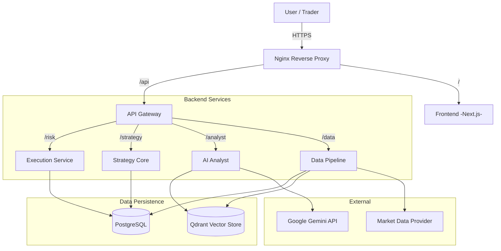

# MTF Trading System - System Architecture

## 1. High-Level Overview

The MTF Trading System is a microservices-based application designed for automated trading of XAU/USD using Multi-Timeframe (MTF) analysis and Smart Money Concepts (SMC). The system is composed of several specialized services that communicate via REST APIs, orchestrated by Docker Compose for local development and deployed to GCP Cloud Run for production.

## 2. Component Diagram

## 3. Microservices Description

### 3.1. Frontend (`frontend`)
- **Tech Stack**: Next.js 16, React 19, TailwindCSS.
- **Responsibility**: User interface for monitoring signals, viewing trade logs, running backtests, and interacting with the AI agent.
- **Communication**: Calls API Gateway for all data.

### 3.2. API Gateway (`services/api-gateway`)
- **Tech Stack**: Python, FastAPI.
- **Responsibility**: Entry point for all backend requests. Handles authentication, routing, and request validation.
- **Communication**: Routes requests to internal microservices.

### 3.3. Execution Service (`services/execution`)
- **Tech Stack**: Python, FastAPI.
- **Responsibility**: Risk management and trade execution. Enforces strict risk rules (e.g., $10 max risk, 0.01 min lot).
- **Key Features**: `can_execute` guardrail, risk calculation, trade logging.

### 3.4. Strategy Core (`services/strategy-core`)
- **Tech Stack**: Python, Vectorbt, Pandas.
- **Responsibility**: Signal generation and backtesting. Implements MTF indicators and SMC logic.
- **Key Features**: Deterministic resampling, parameter sweeping, backtest execution.

### 3.5. AI Analyst (`services/ai-analyst`)
- **Tech Stack**: Python, Google Gemini Pro.
- **Responsibility**: Semantic market analysis and narrative generation.
- **Key Features**: RAG (Retrieval Augmented Generation) using Qdrant, prompt management.

### 3.6. Data Pipeline (`services/data-pipeline`)
- **Tech Stack**: Python, FastAPI, SQLAlchemy, Pandas.
- **Responsibility**: Data ingestion, storage, and processing.
- **Key Features**: OHLCV loading, resampling (15m -> 1H -> 4H -> D), database migration.

## 4. Data Flow

### 4.1. Signal Generation
1.  `Data Pipeline` ingests raw candles.
2.  `Strategy Core` requests data, calculates indicators, and identifies setup zones.
3.  If a signal is found, `Strategy Core` sends a trade proposal to `Execution Service`.
4.  `Execution Service` validates risk (max risk, min lot).
5.  If approved, the trade is logged and executed (simulated for MVP).

### 4.2. Backtesting
1.  User initiates backtest via `Frontend`.
2.  `API Gateway` routes request to `Strategy Core`.
3.  `Strategy Core` fetches historical data from `Data Pipeline` (or DB).
4.  `Strategy Core` runs Vectorbt simulation.
5.  Results are stored in `PostgreSQL` and returned to `Frontend`.

## 5. Infrastructure

- **Local**: Docker Compose orchestrates all services and databases.
- **Production**: GCP Cloud Run (Serverless Containers) + Cloud SQL (PostgreSQL) + Qdrant Cloud (or container).
- **CI/CD**: GitHub Actions for testing and building images. Cloud Build for deployment.
