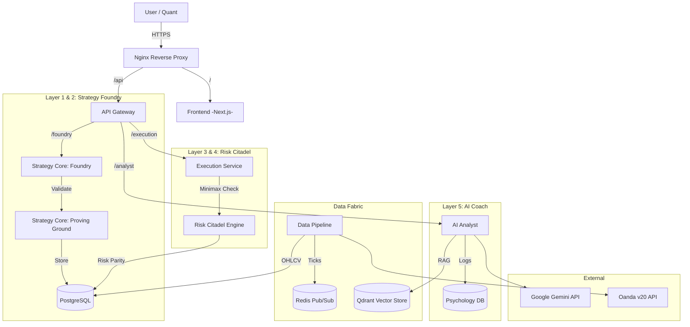

# MTF Olympus - System Architecture

## 1. High-Level Overview

**MTF Olympus** is a distributed quantitative hedge fund platform. It evolves the previous microservices architecture into a 5-layer "Operating System" for wealth creation, separating Logic (Foundry), Validation (Proving Ground), Risk (Citadel), Execution (Edge), and Psychology (Coach).

## 2. Component Diagram

## 3. The 5-Layer Stack

The system is organized into five decoupled layers of responsibility:

| Layer | Name | Responsibility | Key Component |
| :--- | :--- | :--- | :--- |
| **L1** | **Probability** | Statistical Analysis & Data Ingestion. | Data Pipeline / Vectorbt |
| **L2** | **Structure** | Strategy Logic definition & Standardized Blocks. | Strategy Foundry |
| **L3** | **Context** | Validation, Walk-Forward Analysis, Market Regime. | Proving Ground |
| **L4** | **Risk** | Game Theoretic Risk Management (Minimax). | Risk Citadel |
| **L5** | **Intelligence** | Psychological Coaching & Reasoning. | AI Analyst |

## 4. Microservices Description

### 4.1. Frontend (`frontend`)
- **Tech Stack**: Next.js 16, React 19, TailwindCSS.
- **New Features**:
    - **Foundry UI**: Drag-and-drop strategy builder.
    - **Coach Mode**: "Mental Hand History" wizard.
    - **Citadel View**: Portfolio Risk Parity visualization.

### 4.2. Strategy Core (`services/strategy-core`)
- **Role**: The "Foundry" and "Proving Ground".
- **Key Features**:
    - **Core Metrics Engine**: Centralized, vectorized financial math library (Sharpe, Sortino, Alpha/Beta).
    - **Benchmark Service**: Automated benchmarking against XAU/USD, BTC, SPY.
    - **Strategy Assembler**: Compiles JSON `StrategyConfig` into Python pipelines.
    - **Walk-Forward Validator**: Automated Train/Test split engine to assign "Robustness Scores".
    - **Marketplace**: Endpoints for searching and preventing "Lemon" strategies.

### 4.3. Execution Service (`services/execution`)
- **Role**: The "Risk Citadel" and "Execution Edge".
- **Key Features**:
    - **Minimax Engine**: Calculates worst-case regret before accepting any order.
    - **Smart Order Router (SOR)**: Checks liquidity depth before execution.
    - **Portfolio Allocator**: Balances position sizes using Inverse Volatility.

### 4.4. AI Analyst (`services/ai-analyst`)
- **Role**: The "Performance Coach".
- **Key Features**:
    - **Mental State Machine**: FSM tracking A-Game vs C-Game.
    - **Coaching Agent**: Intervenes during tilt using Steenbarger's framework.

    - **RAG**: Retrieves past "Mental Hand Histories" to show patterns.
    - **Quant Tools**: `calculate_efficient_frontier` (PyPortfolioOpt) and `analyze_market_regime` (Quantreo).

### 4.5. Data Pipeline (`services/data-pipeline`)
- **Role**: The foundation. Providing clean, bias-free data for L1 and L3.
- **Key Features**:
    - **Data Ingestion**: Scheduled fetching of OHLCV data from OANDA/Binance.
    - **Historical Backfill**: High-throughput backfilling of historical data (formerly in API Gateway).
    - **Streaming**: Real-time tick data processing via Redis Pub/Sub.

### 4.6. Plugin Architecture (OPA)
- **Role**: Extensibility Engine.
- **Key Features**:
    - **Plugin Engine**: Dynamic loading of `BasePlugin` implementations.
    - **Hook System**: Event-driven hooks (`on_market_data`, `filter_signal`) for modifying system behavior.
    - **Registry**: Database-backed plugin management (`plugins`, `user_plugins`).
    - **Sandboxing**: Isolated execution for 3rd party logic (Planned).

## 5. Data Flow

### 5.1. Strategy Creation & Validation
1.  User assembles logic in **Foundry UI** -> `POST /strategies/assemble`.
2.  **Strategy Core** compiles logic and initiates **Walk-Forward Analysis** (Proving Ground).
3.  If `Robustness Score > 80`, strategy is marked `is_verified=True` and stored in DB.

### 5.2. Live Execution (Citadel-Guarded)
1.  **Strategy Core** generates a Signal (Buy XAU/USD).
2.  Request sent to **Execution Service**.
3.  **Risk Citadel** calculates Minimax Regret for the trade.
    - *If Regret > PainThreshold*: REJECT.
    - *If Regret < PainThreshold*: Proceed.
4.  **Portfolio Allocator** calculates exact lot size based on **Risk Parity** (Volatility-based sizing).
5.  **SOR** executes trade via Oanda.

### 5.3. Psychological Intervention
1.  **AI Analyst** monitors stream: "User closed trade manually 5s after entry" (Panic).
2.  **AI Analyst** flags "C-Game" potential.
3.  If Pattern persists, **AI Analyst** locks Execution API.
4.  Frontend displays **Mental Hand History** form.
5.  User submits reflection -> AI unlocks Execution.
