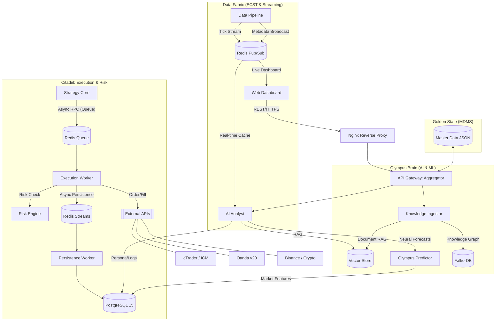
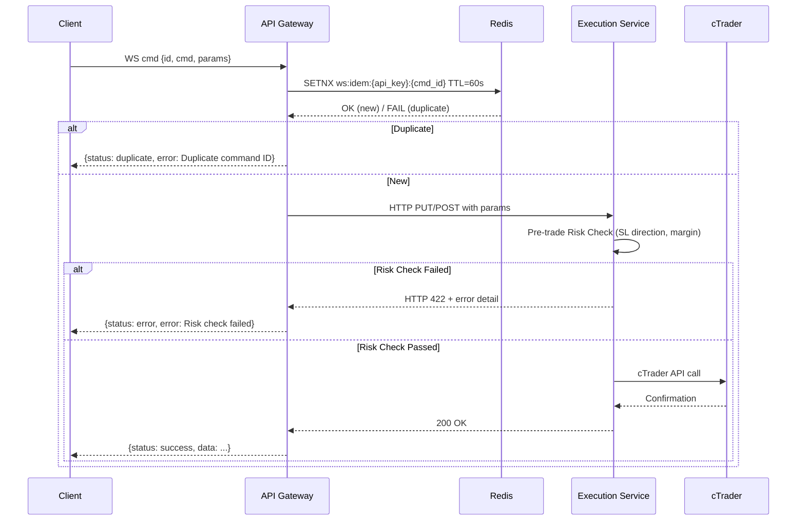

# MTF Olympus - System Architecture

## 1. High-Level Overview

**MTF Olympus** is a distributed quantitative hedge fund platform. It evolves the previous microservices architecture into a 5-layer "Operating System" for wealth creation, separating Logic (Foundry), Validation (Proving Ground), Risk (Citadel), Execution (Edge), and Psychology (Coach).

## 2. Component Diagram



## 3. The 5-Layer Stack

The system is organized into five decoupled layers of responsibility:

| Layer | Name | Responsibility | Key Component |
| :--- | :--- | :--- | :--- |
| **L1** | **Probability** | Statistical Analysis & Data Ingestion. | Data Pipeline / Vectorbt |
| **L2** | **Structure** | Strategy Logic definition & Standardized Blocks. | Strategy Foundry |
| **L3** | **Context** | Validation, Walk-Forward Analysis, Market Regime. | Proving Ground |
| **L4** | **Risk** | Game Theoretic Risk Management (Minimax). | Risk Citadel |
| **L5** | **Intelligence** | Psychological Coaching & Reasoning. | AI Analyst |

## 4. Microservices Description

### 4.1. Frontend (`frontend`)
- **Tech Stack**: Next.js 16, React 19, TailwindCSS.
- **New Features**:
    - **Foundry UI**: Drag-and-drop strategy builder.
    - **Risk Validation**: Multi-layer filters (Sequential + Parallel) for Rule Consistency.
    - **HFT-lite Layer**: High-performance execution core with sub-50ms round-trip targets.
    - **State Awareness**: Replaces direct DB hits with Event-Carried State Transfer (ECST) and Multi-Tiered Caching (Redis + In-Memory + Adapter-specific).
    - **Broker Verification Edge**: Implements mandatory broker-side credential validation for cTrader/ICMarkets via `data-pipeline` before account activation.

### Layer 5: Data (In-Situ & Stream)
- **Shared Memory Cache (L1)**: In-process caching for hot account/fund state.
- **Redis Backbone (L2)**: Pub/Sub distribution for prices (ticks) and execution status.
- **Relational Data (L3)**: PostgreSQL for persistence and historical traceability.

### 4.2. Strategy Core (`services/strategy-core`)
- **Role**: The "Foundry" and "Proving Ground".
- **Key Features**:
    - **Alpha Engine (Athena)**: Secure AST-based expression engine for compiling research factors (`rank`, `delay`) into signals.
    - **Backtesting Engine**: Centralized, vectorized financial math library (Vectorbt).
    - **Strategy Assembler**: Compiles JSON `StrategyConfig` into Python pipelines.
    - **Unified Streaming**: Robust Redis Pub/Sub subscriber supporting pattern matching (`psubscribe`).
    - **Professional Telemetry (v2.2)**: Standardized high-fidelity JSON output for logic evaluations, including MTF indicators, market structure coordinates, and RL-based signal quality scores.
    - **Walk-Forward Validator**: Automated Train/Test split engine to assign "Robustness Scores".

### 4.3. Execution Service (`services/execution`)
- **Role**: The "Risk Citadel" and "Execution Edge".
- **Key Features**:
    - **Minimax Engine**: Calculates worst-case regret before accepting any order.
    - **Smart Order Router (SOR)**: Checks liquidity depth before execution.
    - **Portfolio Allocator**: Balances position sizes using Inverse Volatility.
    - **Institutional Resilience**: Implements professional-grade Circuit Breakers, Request Timeouts, and Priority Execution Queues (Close > Open).

### 4.4. AI Analyst (`services/ai-analyst`)
- **Role**: The "Performance Coach".
- **Key Features**:
    - **Universal Agent**: Configurable "Lego" agent factory (`UniversalAgent`).
    - **Strategy Advisor**: "Co-pilot" aware of Alpha Engine syntax for creating factors logic.
    - **Olympus Workflow Engine (OWE)**: Graph-based multi-agent orchestration.
    - **Self-Awareness (Doc-RAG)**: Ingests system documentation.
    - **Professional CLI (v2.6)**: Bloomberg-style terminal with institutional autocompletion and rotating pro-tips.
    - **Direct Service Orchestration (v3.2)**: Orchestrates internal tools by calling microservices directly (Ports 8001-8005), bypassing the API Gateway to prevent reentrant deadlocks.
    - **ECST Local Cache**: Maintains zero-latency in-memory state for news and market context via Redis `state_updates` broadcasting.
    - **Strategic Synthesis (v2.8)**: Multi-source mandatory confluence logic (SMC + COT + ETF Flows) for high-net-worth decisions, featuring the "Rotation vs Abandonment" thesis.
    - **Language Protocol (v2.9)**: Automated output language adaptation (user-primary) with English-only internal reasoning.
    - **Personalized Q&A**: Leverages `MemoryService` for deep awareness of user preferences and session history.
    - **Psychological MRI**: Analyzes execution patterns for "Tilt".
    - **Jargon Normalization**: Enforces "Medium Financial" jargon levels for executive accessibility.

### 4.5. Data Pipeline (`services/data-pipeline`)
- **Role**: The foundation. Providing clean, bias-free data for L1 and L3.
- **Key Features**:
    - **Data Ingestion**: Scheduled fetching of OHLCV data from OANDA/Binance.
    - **Smart Latch**: Atomic data consistency using Redis Streams (`market.data.stream` -> `market.alpha.stream`).
    - **Feature Worker**: Real-time calculation of technical indicators (RSI, ATR) immediately after candle close.
    - **Tick Streamer**: Dedicated service for real-time market data streaming.
    - **Data Sources**: DB-driven configuration (`DataSource` model) with institutional Fernet encryption for `config_json`.
    - **MTF Implementation**: Native support for 8 timeframes (`M1` to `MN1`) with vectorized transition logic.
    - **Macro Market Observer**: Periodic synchronization of global macro indicators (DXY, VIX, GVZ) from Yahoo Finance to Redis/DB.
    - **Adaptive Throttling**: 10Hz (100ms) safety cap on price updates in `StreamManager` for platform stability.
    - **Ingestion Optimization**: Real-time candle fetching reduced to 20 candles per request to optimize event-loop timing.

### 4.6. Knowledge Ingestor (`services/knowledge-ingestor`)
- **Role**: The "Ingestion Engine" for the Brain.
- **Key Features**:
    - **Manual-Trigger Pipeline**: Transitioned from automated background tasks to a strictly manual, audit-ready trigger system via API.
    - **Tiered High-Density Extraction**: Implements 3-tier deep analysis (Summary -> Detail -> Conclusion) for maximum knowledge density and strategic logic capture.
    - **Semantic Concept Merger**: LLM-driven maintenance tool for deduplicating concepts and clustering related information in FalkorDB.
    - **Graph Intelligence**: Ingests unstructured data into FalkorDB for relationship mapping with institutional ontology (Ticker, Indicator, Source).
    - **Vector Integration**: Generates embeddings and syncs with Qdrant for semantic search.


## 4.11. Data Governance & Institutional Security

### H1: Master Data Management System (MDMS)
To prevent schema drift and ensure deployment reproducibility, the system implements a **Spec-First MDMS**:
- **Golden State**: The "Master Data" (Users, Accounts, Symbols, Rules) is versioned in `master_data/*.json` at the project root.
- **Bi-directional Sync**: The `manage_master_data.py` script provides atomic `export` (DB -> JSON) and `import` (JSON -> DB) capabilities.
- **Sanitization**: Export operations automatically sanitize sensitive credentials with `SECRET_` placeholders to prevent Git leaks.

### H2: Institutional Security Standard (DataSource Encryption)
All sensitive 3rd-party credentials (API Keys, Tokens, Secret Keys) are protected at rest via **Institutional Security Standards**:
- **Field-Level Encryption**: Both `BrokerAccount` and `DataSource` configurations are encrypted using **Fernet (AES-128 in CBC mode)**.
- **Zero-Exposure Backups**: Exported `master_data/` files contain encrypted Base64 blobs. Decryption keys are managed strictly via environment variables (`SETTINGS_ENCRYPTION_KEY`).
- **Runtime Decryption**: Decryption occurs only at the point of use (e.g., within the `api-gateway` or during `data-pipeline` discovery) and is never persisted in logs.

### 4.12. Symbol Metadata Communication Path (Circular Dependency Prevention)
To maintain system resilience and ensure sub-second startup, the **Execution Service** follows a strict data resolution hierarchy for symbol metadata:
1.  **L1 (In-Memory)**: Local dictionary cache within the adapter (e.g., `ctrader.py`).
2.  **L2 (Redis ECST)**: Shared metadata broadcast by the `Data Pipeline` to Redis hashes (`exec:symbols:{provider}`).
3.  **L3 (Direct Service Fallback)**: If L1/L2 miss, the `Execution Service` MUST call the `Data Pipeline` directly (`http://data-pipeline:8000/api/v1/symbols`).
4.  **REENTRANT FORBIDDEN**: Calling the `API Gateway` from the `Execution Service` for internal metadata is strictly forbidden to prevent startup deadlocks.


### 4.6. Plugin Architecture (OPA)
- **Role**: Extensibility Engine.
- **Key Features**:
    - **Plugin Engine**: Dynamic loading of `BasePlugin` implementations.
    - **Hook System**: Event-driven hooks (`on_market_data`, `filter_signal`) for modifying system behavior.
    - **Registry**: Database-backed plugin management (`plugins`, `user_plugins`).
    - **Sandboxing**: Isolated execution for 3rd party logic (Planned).

## 4.7. Performance Optimization (HFT-lite)
To achieve sub-50ms round-trip latency for external clients, the system utilizes a **Tiered Caching Strategy**:

1.  **L1 Gateway Cache (In-Memory)**: API Keys, Session States, and Auth signatures are cached in-process within the `api-gateway` (300s TTL).
2.  **L2 Service Cache (Redis)**: Shared state like `BrokerAccount` metadata and `Credentials` are cached in Redis for fast cross-service resolution.
3.  **L3 Adapter Cache (In-Memory)**: `Execution Service` adapters (e.g., cTrader) maintain a pre-hydrated Symbol/Contract ID map to eliminate DB lookups during order execution.
4.  **HFT-lite Execution Path**:
    - **Non-blocking Persistence**: Trade journaling is performed via background tasks to ensure minimal WebSocket response latency.
5.  **Rule 7 Hot-Path Protection (DB-Free)**:
    - **Logic**: Removal of ALL proactive `await db.execute()` calls from the critical path (Order placement -> Broker send -> Fill confirmation).
    - **Persistence**: Decoupled via Redis Streams (`execution.filled.stream`) consumed by background workers for eventual consistency.
    - **NO GATEWAY WRITES**: The API Gateway MUST NOT create any `Trade` records synchronously. Persistence is the sole responsibility of the Execution Service worker to prevent zero-price ($0.0$) placeholder records.
    - **Resolution**: Use Tiered Caching (L3) for symbol metadata and risk limits.
6.  **No Reentrant Gateway Calls (Deadlock Prevention)**:
    - **Logic**: AI Agents and Tools MUST NOT call the `api-gateway` internally to fetch data already managed by other services.
    - **Standard**: All internal tool requests are routed directly to the target service (Discovery via Docker Service Names).

## 4.8. Safety Guardrails (Sprint F)

Because the system operates on a **live account with real capital**, every mutation command (`execute`, `amend`, `close`) passes through three layers of safety checks before reaching the broker:



### Layer 1: Idempotency Guard (API Gateway)
- **Mechanism**: Redis `SETNX` with 60-second TTL keyed on `{api_key}:{client_cmd_id}`.
- **Prevents**: Duplicate WS sends (network retry, client bug, or malicious double-spend).
- **Client obligation**: Every `execute`, `amend`, `close` command **must** include a unique `id` field.

### Layer 2: HMAC Replay Attack Window (API Gateway)
- **Mechanism**: Timestamp must be within ±30 seconds of server time.
- **Prevents**: Intercepted tokens being replayed after capture.
- **Implementation**: `hmac_utils.py` — already enforced.

### Layer 3: Pre-trade Risk Validation (Execution Service)
- **For `amend`**: Validates that the new SL/TP prices are directionally correct (SL below entry for LONG, above for SHORT) and that any size increase is within available margin.
- **For `close`**: Validates that the position exists before attempting close (mapped to `ValueError` → HTTP 404).
- **Error codes**: `422 Unprocessable Entity` for invalid parameters, `404 Not Found` for missing resources.

## 4.9. Performance & Reliability (Sprint G)

Production-grade WebSocket reliability features, modeled on institutional trading systems (FIX Protocol, Netflix Hystrix, Jane Street).

### G1: WebSocket Heartbeat / Keepalive

**Problem**: Silent disconnect — client sends orders thinking it's connected, but messages are dropped.

**Mechanism** (FIX Protocol Heartbeat):
- Server sends `{"type": "ping", "ts": <epoch>}` every **30 seconds**
- Client must respond with `{"type": "pong", "ts": <echo>}` within **10 seconds**
- Missing pong → `WebSocket.close(code=1001)` + cleanup + log

**Implementation**:
- `_heartbeat_loop(websocket, interval=30, timeout=10)` co-routine runs concurrently with the command loop
- Uses `asyncio.gather()` for concurrent heartbeat + recv

---

### G2: Circuit Breaker for Execution Service

**Problem**: Execution Service down → every WS command blocks for 20-30s timeout → WS loop crash.

**States** (Hystrix pattern):

```
CLOSED → (5 consecutive failures) → OPEN → (30s recovery) → HALF-OPEN → (1 probe success) → CLOSED
```

| State | Behavior | Recovery |
|---|---|---|
| CLOSED | Normal routing to Execution | — |
| OPEN | Instant reject: `{"status": "service_unavailable"}` | Wait 30s then probe |
| HALF-OPEN | Send 1 probe request | Success → CLOSED, Fail → OPEN |

**Implementation**: `CircuitBreaker` class in `utils/circuit_breaker.py`, wrapping all `ExecutionClient` calls.

---

### G3: Redis Command Queue (Async RPC)

**Problem**: Every WS mutation is a synchronous HTTP call (~20-50ms) — WS loop blocks on execution spikes.

**Mechanism** (Jane Street Fire-and-forget + callback):
1. WS receive `execute`/`amend`/`close` command
2. Push to Redis Stream `execution:cmd:{account_id}` → return `{"status": "queued", "trace_id": "..."}` in < 2ms
3. Execution Service worker consumes stream → processes → publishes to `execution:result:{trace_id}`
4. Client polls with `{"cmd": "poll", "trace_id": "..."}` or receives push callback

> **Note**: Read commands (`get_account`, `get_orders`, `get_trades`) remain synchronous.

**New files**:
- `services/api-gateway/app/services/execution_queue.py` — enqueue + poll helpers
- `{"cmd": "poll"}` command handler in `external.py`

---

### G4: Structured Logging (trace_id / post-trade audit)

**Problem**: Plain text logs — impossible to correlate a specific order across service boundaries.

**Mechanism** (Virtu Financial style):
- Every WS command receives a `trace_id` (client-supplied `id` or server-generated UUID)
- JSON log line emitted before and after every command: `{"ts", "trace_id", "cmd", "api_key", "status", "latency_ms"}`
- `trace_id` included in every response to client

**Implementation**: `StructuredLogger` in `utils/structured_logger.py` using Python `logging` with `JSONFormatter`.

---

### G5: Client-side Reconnection SDK

**Problem**: Network disruption → client must implement reconnect logic manually (complex, often buggy).

**Mechanism** (Bloomberg API style) — Python Reference Client at `tools/ws_client/`:
- Auto-reconnect with **exponential backoff**: 1s → 2s → 4s → 8s → max 30s
- Re-authenticate (HMAC) on reconnect automatically
- **Command queue**: buffer unsent commands during disconnect, replay on reconnect
- Callbacks: `on_disconnect(reason)`, `on_reconnect(attempt)`, `on_message(data)`

---

## 4.10. Production Hardening (Sprint H)

Institutional-grade production controls, modeled on Interactive Brokers order management and FIX Protocol ExecutionReport.

### H1: Per-Command Rate Limiting (Tiered)

**Problem**: Current global 10 rps limit — `get_account` flood can consume all quota, blocking `execute` commands.

**Mechanism** (Interactive Brokers category-based limits):

| Category | Commands | Limit | Rationale |
|---|---|---|---|
| `TRADE` | `execute`, `amend`, `close` | 5 rps | Prevents accidental order flood |
| `MANAGE` | `cancel` | 20 rps | Cancel must be fast; typically low volume |
| `READ` | `get_account`, `get_orders`, `get_trades` | 50 rps | Safe for UI polling |

**Mechanism**: Redis Sliding Window Counter keyed on `rate:{api_key}:{category}` with 1-second TTL.
- Rejected response: `{"status": "rate_limited", "retry_after": 1, "category": "TRADE"}`
- **Implementation**: `utils/rate_limiter.py` → `CommandRateLimiter.check(api_key, cmd)`

---

### H2: Order Confirmation Callback (PENDING → FILLED)

**Problem**: WS `execute` sends one response then ends. Client has no idea if the order actually filled.

**Mechanism** (FIX Protocol ExecutionReport — 2-phase response):

```
Phase 1 — Immediate (< 50ms):    {"type": "execution", "status": "PENDING", "trace_id": "..."}
Phase 2 — Async broker confirm:  {"type": "fill",      "status": "FILLED",  "trace_id": "...", "fill_price": ..., "fill_time": ...}
```

**Flow**:
1. API Gateway receives `execute` → routes to Execution Service
2. Execution Service sends to cTrader → immediately returns `PENDING` to Gateway
3. cTrader position update callback received by `ctrader.py`
4. Execution Service publishes to Redis `execution:fills:{account_id}` (TTL 300s)
5. API Gateway `_fill_subscriber_loop()` reads Redis → pushes `fill` event to WS client

**New files**:
- `services/execution/app/services/fill_publisher.py` — Redis LPUSH fill events
---

### Sprint I: Validation & Reconnection Proof

To ensure partner integration safety, the WebSocket channel and its reference SDK have been validated against network disruptions.

- **Auto-reconnect**: Exponential backoff (1s → 30s) prevents server hammering.
- **Message Queuing**: Commands sent during downtime are buffered in memory and replayed upon reconnection to prevent signal loss.
- **Heartbeat (Liveness)**: 30s ping/pong protocol ensures dead connections are detected and recycled within 40s.

---

## 5. Data Flow

### 5.1. Strategy Creation & Validation
1.  User assembles logic in **Foundry UI** -> `POST /strategies/assemble`.
2.  **Strategy Core** compiles logic and initiates **Walk-Forward Analysis** (Proving Ground).
3.  If `Robustness Score > 80`, strategy is marked `is_verified=True` and stored in DB.

### 5.2. Live Execution (Citadel-Guarded)
1.  **Strategy Core** generates a Signal (Buy XAU/USD).
2.  Request sent to **Execution Service**.
3.  **Risk Citadel** calculates Minimax Regret for the trade.
    - *If Regret > PainThreshold*: REJECT.
    - *If Regret < PainThreshold*: Proceed.
4.  **Portfolio Allocator** calculates exact lot size based on **Risk Parity** (Volatility-based sizing).
5.  **SOR** executes trade via Oanda.

### 5.3. Psychological Intervention
1.  **AI Analyst** monitors stream: "User closed trade manually 5s after entry" (Panic).
2.  **AI Analyst** flags "C-Game" potential.
3.  If Pattern persists, **AI Analyst** locks Execution API.
4.  Frontend displays **Mental Hand History** form.
5.  User submits reflection -> AI unlocks Execution.

### 5.5. Sentiment-to-Risk Autonomous Pipeline
To enhance institutional-grade risk management, Phase 56 introduced the **Sentiment-to-Risk** pipeline:
1.  **Sentiment Ingestion**: `AI Analyst` periodically scores market sentiment for `XAUUSD` using Gemini 2.5 (Bullish/Bearish).
2.  **Drift Calculation**: The `SentimentDriftAgent` compares weighted sentiment against historical norms and active fund risks.
3.  **Risk Rebalance**: If sentiment significantly drifts, the system autonomously scales the `Fund` risk (% NAV) up or down.
4.  **Audit & Alerts**: All rebalances are recorded in `rebalance_history` and broadcast via Telegram for transparency.

### 5.6. FMEA Guardrails Signal Flow
To prevent trading in low-probability environments, Phase 55 implemented **FMEA (Failure Mode and Effects Analysis)** guardrails:
1.  **Momentum Filter**: Rejects signals if price change over N periods exceeds institutional thresholds (preventing "Catching Falling Knives").
2.  **Expansion Layer**: Ensures trade entry coincides with high-volume expansion (FVG/Expansion candles), avoiding low-liquidity ranges.
3.  **SMT Divergence (Smart Money Tool)**: Validates `XAUUSD` signals against correlated assets (`DXY`, `Silver`). Failure to find correlation results in signal rejection.

## 6. Intelligence & Caching (v2.7+)
To manage the high latency of Gemini LLM calls, the **AI Analyst** implements **Semantic Caching**:
- **Mechanism**: Redis Vector Search using `redisvl`.
- **Logic**: Queries are embedded and compared against cached responses. If Cosine Distance <= 0.1 (Similarity > 0.9), the cached response is returned.
- **Freshness**: A 1-hour TTL is enforced for `MARKET_ANALYSIS` and `CHAT` queries to ensure data relevance.
- **Telemetry**: Hit/Miss metrics are exposed to the AI Dashboard for performance monitoring.
```
