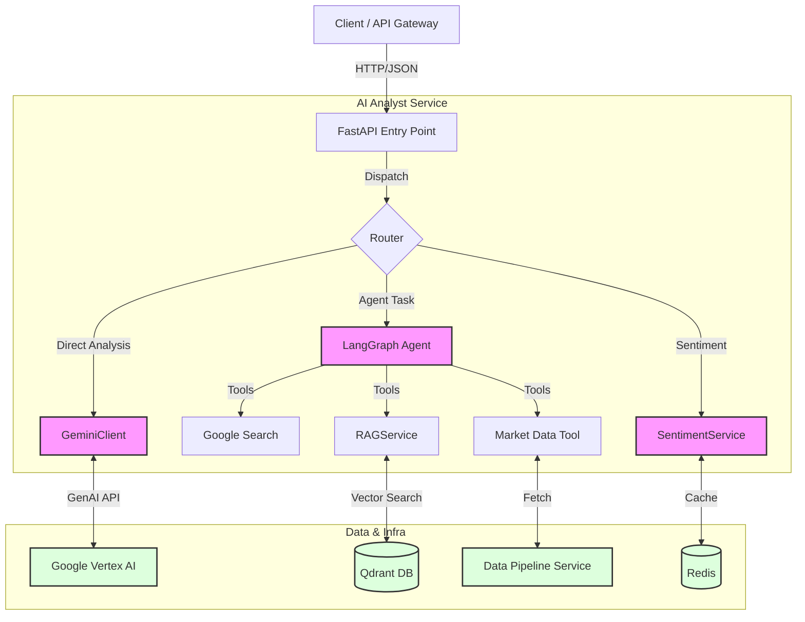

# 03 - AI Agent Specification

**Version:** 1.1
**Status:** IMPLEMENTED (Phase 3 Verified)

---

## 1. Overview
The **AI Analyst** is a specialized microservice designed to act as a "Co-Pilot" for the trading system. Unlike the Strategy Core, which relies on rigid math and logic, the AI Analyst uses **Large Language Models (LLMs)** and **Retrieval Augmented Generation (RAG)** to provide semantic understanding of market conditions, news, and trading journaling.

## 2. Core Capabilities

### 2.1. Semantic Market Analysis
- **Goal:** Provide a "Narrative Bias" (Bullish/Bearish/Neutral) to augment technical signals.
- **Input:**
    - Recent OHLCV data (H4/D1 trends).
    - Economic Calendar events (e.g., CPI, FOMC).
    - Recent news headlines (from external APIs).
- **Process:**
    - LLM summarizes market context.
    - Generates a "Sentiment Score" (-1.0 to +1.0).
    - Outputs a key narrative (e.g., "Gold is rallying due to safe-haven demand").

### 2.2. Intelligent Journaling (Psychological MRI)
- **Goal:** Analyze trader behavior and identify psychological leaks.
- **Input:**
    - Trade logs (Entry/Exit, PnL).
    - User written journal entries (Mental State, Root Cause).
- **Process:**
    - **Pattern Recognition:** Uses RAG to compare current entry with historical "Tilt" or "Revenge Trading" patterns stored in Qdrant.
    - **Feedback Loop:** Suggests corrective actions (e.g., "Stop trading for 2 hours").

### 2.3. Multimodal Chart Analysis
- **Goal:** Visual analysis of price action patterns (Head & Shoulders, Wedges) that are hard to describe mathematically.
- **Input:** Chart screenshots (images) from the frontend.
- **Process:**
    - Gemini Vision Model analyzes the image.
    - Correlates visual patterns with mathematical indicators.

### 2.4. Agentic Code Execution (Strategy Advisor)
- **Goal:** Verify strategies by running them, not just hallucinating code.
- **Agent:** `StrategyAdvisorAgent`
- **Process:**
    - Agent generates Python code (using `vectorbt`).
    - Code is executed in a secure sandbox (via Strategy Core).
    - Results (PnL, Sharpe) are fed back to the agent to refine the strategy.

### 2.5. Real-Time Search Grounding (Market Observer)
- **Goal:** Incorporate live breaking news (not just scheduled calendar events).
- **Agent:** `MarketObserverAgent`
- **Process:** Use Google Search Tool to find reasons for sudden volatility (e.g., "Why is Gold dropping?").

### 2.6. Daily Briefing Agent
- **Goal:** Autonomous daily market reporting.
- **Agent:** `DailyBriefingAgent`
- **Process:** Compiles overnight price action, news, and calendar events into a morning briefing.

### 2.7. Episodic Memory (Trade Learning)
- **Goal:** Autonomous learning from historical trade outcomes to prevent recurrent mistakes.
- **Process:**
    - Background job (`/agent/memory/sync`) finds closed trades without an AI-generated `JournalEntry`.
    - Agent analyzes the trade (Execution Data vs Original Narrative).
    - Extracts `ai_insight` (the actionable lesson) and stores it in the `JournalEntry` table.

## 3. Architecture components

### 3.1. System Data Flow



### 3.2. RAG Engine (Retrieval Augmented Generation)
- **Vector Database:** Qdrant
- **Embedding Model:** `models/gemini-embedding-001` (Google).
- **Collections:**
    - `journal_entries`: Past trade reviews and psychological states.
    - `strategies`: Catalog of trading strategies and code.
    - `system_docs`: Project documentation for context.

### 3.2. Reasoning Engine (LangChain/LangGraph)
- **Orchestrator:** LangGraph `create_react_agent`.
- **Tools:**
    - `GetMarketContextTool`: Fetch price/trend.
    - `GetTechnicalSignalsTool`: unique signals.
    - `GetAccountStatusTool`: Exposure checking.
    - `GoogleSearchTool`: Real-time web search.
    - `GetEconomicCalendarTool`: Scheduled events.
    - `GetStrategyPerformanceTool`: Backtest runner.
- **Nodes & Loop (OODA):**
    - **Observe:** Fetch data via tools.
    - **Orient:** Retrieve similar historical contexts or specs.
    - **Decide (Hypothesis Verification):** Formulate an opinion based on **Institutional Synthesis Protocols**. The new `hypothesis_tester` node ensures tools actually verify assumptions before finalizing.
    - **Act:** Output analysis or alert.
    - **Learn:** The `node_learn_from_outcomes` continuously extracts lessons from the `trades` table.

### 3.3. Institutional Synthesis Protocols (v2.6)
To ensure high-fidelity responses for institutional-grade queries, the following routing logic is enforced:
1.  **Strategic Decisions** (e.g., "Long or Flat?"): **MANDATORY** multi-tool call: `smc_technical_analysis` + `cot_analyst` + `market_state`.
2.  **Real-Time Risk Audit** (e.g., "Max Drawdown"): **DO NOT** use `backtest_runner`. Instead, use `calibrate_efp_parameters` to fetch `sigma` (volatility) and compute via `python_sandbox`.
3.  **Liquidity Depth**: Use `market_state` to identify Gamma Walls and institutional sell walls.

## 4. Data Models

### 4.1. AnalysisResponse (Implemented)
```python
class AnalysisResponse(BaseModel):
    insight: str # Markdown formatted narrative
    timestamp: datetime
```
*Note: Full object decomposition (sentiment_score, drivers) is currently handled within the text 'insight' or by specific specialized agents.*

### 4.2. MarketNarrative (Target V2)
```python
class MarketNarrative(BaseModel):
    timestamp: datetime
    sentiment_score: float # -1 to 1
    summary: str
    key_drivers: List[str] # ["Inflation", "War", "Yields"]
    recommendation: str # "Risk Off", "Look for Longs"
```

## 5. API Interface

### 5.1. Generate Analysis
- **POST** `/analyze/market`
- **Body:** `MarketAnalysisRequest` (OHLCV, Trends, Image)
- **Response:** `AnalysisResponse`

### 5.2. Journal Feedback
- **POST** `/analyze/journal`
- **Body:** `JournalAnalysisRequest` (Content, Entry ID)
- **Response:** `AnalysisResponse` (Analysis + RAG matches implied in text)

### 5.3. SMC Narrative
- **POST** `/analyze/smc-narrative`
- **Body:** `SMCNarrativeRequest` (Smart Money Concepts Data)
- **Response:** `AnalysisResponse`

### 5.4. Market Observer Agent
- **POST** `/agent/observer/run`
- **Body:** `{ "input_text": "Analyze XAUUSD details" }`
- **Response:** `{ "report": "...", "timestamp": "..." }`

### 5.5. Strategy Advisor Chat
- **POST** `/ai/chat/sessions/message`
- **Body:** `{ "message": "Optimize this MACD params...", "context_code": "..." }`
- **Response:** `{ "response": "..." }`

### 5.6. Episodic Memory Sync
- **POST** `/agent/memory/sync`
- **Body:** Internal / Cron triggered
- **Response:** `{ "status": "success", "trades_analyzed": 5 }`

## 6. Infrastructure & Roadmap
The service is fully containerized and integrated with:
- **Redis:** For sentiment caching.
- **Qdrant:** For RAG memory.
- **Google Vertex AI / Studio:** For Gemini 2.5 models.
