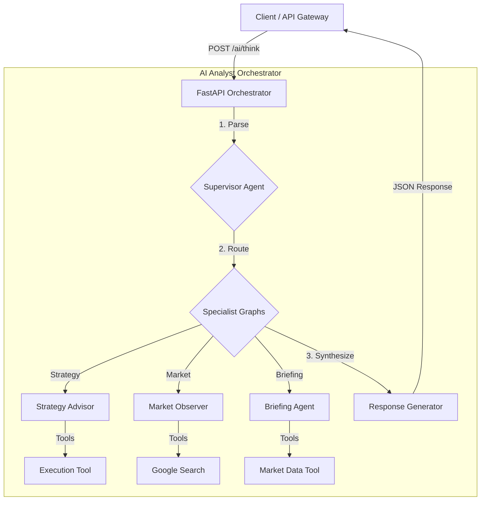

# 03 - AI Agent Specification

**Version:** 1.3
**Status:** STABLE (v2.9 Architecture - agentskills.io Standard)

---

## 1. Overview
The **AI Analyst** is a specialized microservice designed to act as a "Co-Pilot" for the trading system. Unlike the Strategy Core, which relies on rigid math and logic, the AI Analyst uses **Large Language Models (LLMs)** and **Retrieval Augmented Generation (RAG)** to provide semantic understanding of market conditions, news, and trading journaling.

## 2. Core Capabilities

### 2.1. Semantic Market Analysis
- **Goal:** Provide a "Narrative Bias" (Bullish/Bearish/Neutral) to augment technical signals.
- **Input:**
    - Recent OHLCV data (H4/D1 trends).
    - Economic Calendar events (e.g., CPI, FOMC).
    - Recent news headlines (from external APIs).
- **Process:**
    - LLM summarizes market context.
    - Generates a "Sentiment Score" (-1.0 to +1.0).
    - Outputs a key narrative (e.g., "Gold is rallying due to safe-haven demand").

### 2.2. Intelligent Journaling (Psychological MRI)
- **Goal:** Analyze trader behavior and identify psychological leaks.
- **Input:**
    - Trade logs (Entry/Exit, PnL).
    - User written journal entries (Mental State, Root Cause).
- **Process:**
    - **Pattern Recognition:** Uses RAG to compare current entry with historical "Tilt" or "Revenge Trading" patterns stored in Qdrant.
    - **Feedback Loop:** Suggests corrective actions (e.g., "Stop trading for 2 hours").

### 2.3. Multimodal Chart Analysis
- **Goal:** Visual analysis of price action patterns (Head & Shoulders, Wedges) that are hard to describe mathematically.
- **Input:** Chart screenshots (images) from the frontend.
- **Process:**
    - Gemini Vision Model analyzes the image.
    - Correlates visual patterns with mathematical indicators.

### 2.4. Agentic Code Execution (Strategy Advisor)
- **Goal:** Verify strategies by running them, not just hallucinating code.
- **Agent:** `StrategyAdvisorAgent`
- **Process:**
    - Agent generates Python code (using `vectorbt`).
    - Code is executed in a secure sandbox (via Strategy Core).
    - Results (PnL, Sharpe) are fed back to the agent to refine the strategy.

### 2.5. Real-Time Search Grounding (Market Observer)
- **Goal:** Incorporate live breaking news (not just scheduled calendar events).
- **Agent:** `MarketObserverAgent`
- **Process:** Use Google Search Tool or **OpenClaw Autonomous Researcher** (browser-based scraping) to find reasons for sudden volatility (e.g., "Why is Gold dropping?").

### 2.6. Daily Briefing Agent
- **Goal:** Autonomous daily market reporting.
- **Agent:** `DailyBriefingAgent`
- **Process:** Compiles overnight price action, news, and calendar events into a morning briefing.

### 2.7. Episodic Memory (Trade Learning)
- **Goal:** Autonomous learning from historical trade outcomes to prevent recurrent mistakes.
- **Process:**
    - Background job (`/api/v1/ai/agent/memory/sync`) finds closed trades without an AI-generated `JournalEntry`.
    - Agent analyzes the trade (Execution Data vs Original Narrative).
    - Extracts `ai_insight` (the actionable lesson) and stores it in the `JournalEntry` table.

### 2.8. Institutional Tool Resilience (v2.9+)
- **Base Inheritance**: All core tools MUST inherit from `app.core.base_tool.BaseTool`.
- **Logic Isolation**: Logic is implemented in `async def run_tool()`. Legacy `_run`/`_arun` patterns are forbidden.
- **Resilience Features**: Automatic exponential backoff, circuit breakers, and IO semaphores are enabled by default.
- **Schema Enforcement**: Tools use Pydantic `args_schema` and centralized normalization to handle both `dict` and `str` inputs.
- **Validation**: Enforced via `scripts/verify_tool_standards.py`.

### 2.9. Dynamic Agent Skills (agentskills.io Standard)
- **Goal:** Enable the agent to discover, load, and execute specialized workflows defined in `SKILL.md` files.
- **Architecture:**
    - **Progressive Disclosure**: Main agent system prompt contains only skill names and descriptions (metadata).
    - **Skill Discovery**: Scans `services/ai-analyst/skills/` AND `example/skills/` for `SKILL.md` files.
    - **Physical Skeleton**: Skills use a standard folder structure:
        - `SKILL.md`: Main instructions and frontmatter.
        - `scripts/`: Executable assets.
        - `references/`: Contextual documents injected into sub-agents.
    - **Skill Execution**: Spawns a transient **Sub-Agent** with full skill instructions when triggered via `ExecuteSkillTool`.

## 3. Architecture components

### 3.1. System Data Flow (Consolidated v3.0)



### 3.2. RAG Engine (Retrieval Augmented Generation)
- **Vector Database:** Qdrant
- **Embedding Model:** `models/gemini-embedding-001` (Google).
- **Collections:**
    - `journal_entries`: Past trade reviews and psychological states.
    - `strategies`: Catalog of trading strategies and code.
    - `system_docs`: Project documentation for context.

### 3.2. Reasoning Engine (LangChain/LangGraph)
- **Orchestrator**: LangGraph `create_react_agent`.
- **Tool Architecture**: Resilient Wrapper pattern using `BaseTool`.
- **Core Tools**:
    - `GetMarketContextTool`: Fetch price/trend.
    - `GetTechnicalSignalsTool`: Unique signals.
    - `GetAccountStatusTool`: Exposure checking.
    - `GoogleSearchTool`: Real-time web search.
    - `GetEconomicCalendarTool`: Scheduled events.
    - `OpenClawResearcherTool`: Agentic browser research with **Autonomous Mode** for zero-cost scraping.
    - `OpenClawChatTool`: Direct stateful conversation with AI Browser agents.
    - `CalculateEfficientFrontierTool`: Portfolio optimization.
    - `ShellCommandTool`: Execute bash commands for system operations.
    - `PythonInterpreterTool`: Run generic Python code for advanced logic.
    - `WebReaderTool`: Web content extraction.
- **Nodes & Loop (OODA)**:
    - **Observe**: Fetch data via resilient tools.
    - **Orient**: Retrieve similar historical contexts or specs via RAG.
    - **Decide (Hypothesis Verification)**: Formulate an opinion based on **Institutional Synthesis Protocols**. The `hypothesis_tester` node ensures tools actually verify assumptions before finalizing.
    - **Act**: Output analysis or alert.
    - **Learn**: The `node_learn_from_outcomes` continuously extracts lessons from the `trades` table to build episodic memory.

### 3.3. Institutional Synthesis Protocols (v2.6)
To ensure high-fidelity responses for institutional-grade queries, the following routing logic is enforced:
1.  **Strategic Decisions** (e.g., "Long or Flat?"): **MANDATORY** multi-tool call: `smc_technical_analysis` + `cot_analyst` + `market_state`.
2.  **Real-Time Risk Audit** (e.g., "Max Drawdown"): **DO NOT** use `backtest_runner`. Instead, use `calibrate_efp_parameters` to fetch `sigma` (volatility) and compute via `python_sandbox`.
3.  **Liquidity Depth**: Use `market_state` to identify Gamma Walls and institutional sell walls.

### 3.4. Dynamic Topology & Sentinel Layer (v2.2)
To enhance safety and efficiency, the agent uses a dynamic graph topology based on query severity.

#### 3.4.1. Severity Classification
- **ROUTINE**: Simple queries or briefings. Minimal node path (`query_optimizer` -> `generate`).
- **VOLATILITY**: High-impact queries requiring RAG and Reasoning.
- **CRISIS**: Extreme market events. Full node path including `Sentinel` and `Consensus Layer`.

#### 3.4.2. Sentinel Layer
An adversarial node that reviews the primary agent's output for:
- **Hallucination**: Verification of price data and news facts.
- **Logic**: Checking consistency between analysis and recommendation.
- **Economic Sanity**: Hard Python-based risk constraints (Margin, Lot Size, SL/TP direction).

#### 3.4.3. Consensus Layer (CRISIS only)
Dual-model verification using:
- **Primary**: Google Gemini 2.5 Pro.
- **Secondary**: Claude 3.5 Sonnet / MiniMax via **OpenRouter**.
Both models must agree on trade direction and critical levels within 0.5% tolerance.

#### 3.4.4. Semantic Caching Node
A high-speed filtering node that checks Redis for semantically similar historical responses before invoking the Reasoner.
- **Coverage**: `RESEARCH`, `STRATEGY_DESIGN`, `MARKET_ANALYSIS`, `CHAT`.
- **Freshness Window**: 3600s (1 hour).
- **Threshold**: 0.90 similarity.
- **ECST Integration (v3.1)**: Market context and headlines are pre-hydrated into the `StateCache` via Redis Pub/Sub, allowing `GetMarketContextTool` to resolve in O(1) time without external I/O.

## 4. Data Models

### 4.1. AnalysisResponse (Implemented)
```python
class AnalysisResponse(BaseModel):
    insight: str # Markdown formatted narrative
    timestamp: datetime
```
*Note: Full object decomposition (sentiment_score, drivers) is currently handled within the text 'insight' or by specific specialized agents.*

### 4.2. MarketNarrative (Target V2)
```python
class MarketNarrative(BaseModel):
    timestamp: datetime
    sentiment_score: float # -1 to 1
    summary: str
    key_drivers: List[str] # ["Inflation", "War", "Yields"]
    recommendation: str # "Risk Off", "Look for Longs"
```

## 5. Unified API Interface

### 5.1. Unified Orchestration
- **POST** `/api/v1/ai/think`
- **Body:** `AIThinkRequest` (Generic entry point)
- **Response:** `AIThinkResponse`
- **Logic**: Routes internally to `StrategyAdvisor`, `MarketObserver`, or `BriefingAgent` based on semantic intent and market regime.

### 5.2. Background & Episodic Tasks
- **POST** `/api/v1/ai/agent/memory/sync`
- **Logic**: Background sync for trade learning.

### 5.3. Legacy Endpoints (DEPRECATED)
- `/api/v1/ai/briefing` (Use `/ai/think?intent=briefing`)
- `/api/v1/ai/market-analysis`
- `/api/v1/ai/journal-analysis`
- `/api/v1/ai/agent/observer/run`

## 6. Infrastructure & Roadmap
The service is fully containerized and integrated with:
- **Redis:** For sentiment caching.
- **Qdrant:** For RAG memory.
- **Google Vertex AI / Studio:** For Gemini 2.5 models.
