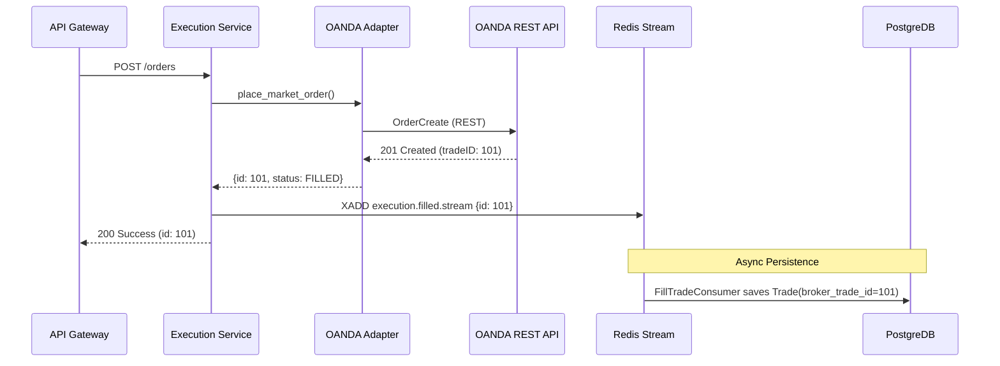
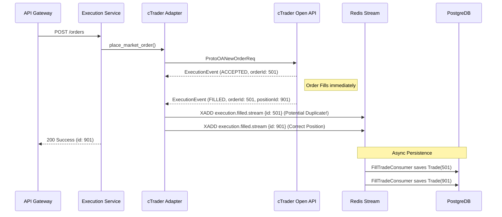
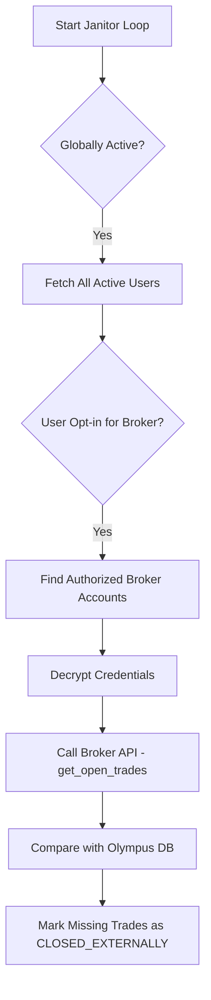

# Broker Architecture & Order Management Comparison Report

## 1. Executive Summary
This report analyzes the core differences between **OANDA (REST v20)** and **cTrader (Open API 2.0)** implementations in the MTF Olympus systems, specifically focusing on the Redis synchronization flow, symbol resolution, and the root cause of the "Duplicate Order/Amendment Failure" bug reported in cTrader.

## 2. Root Cause Analysis: The cTrader ID Mismatch
The primary reason orders are being "opened instead of modified" in cTrader, and why duplicate records appear in the database, is due to the **Dual ID Lifecycle** of cTrader orders:

### The Problem
*   **OANDA Strategy**: A single `tradeID` covers the order and the resulting position.
*   **cTrader Strategy**: 
    1.  An `orderId` is generated when the request is accepted.
    2.  A `positionId` is generated when the order is filled.
    3.  **Conflict**: The system currently receives multiple `ExecutionEvent` messages (ACCEPTED, FILLED). If the adapter publishes both to the Redis Stream, the [FillTradeConsumer](file:///home/dan/workspace/mtf-trading-system/services/execution/app/worker.py#124-298) (using deterministic UUIDs based on the provided ID) creates **two separate Trade records** in the database: one for the `orderId` and one for the `positionId`.
*   **Result**: When an amendment is triggered, the system might be looking at the `orderId`-based record, but cTrader requires the `positionId` to modify an open trade. This leads to a 404/Not Found error, which the strategy might handle by placing a new order.

## 3. Data Flow Process Comparison

### OANDA (REST-Pull & Stream Sync)

1.  **Placement**: `api-gateway` -> [execution](file:///home/dan/workspace/mtf-trading-system/services/api-gateway/app/services/internal_client.py#82-93) -> [OandaOrderAdapter](file:///home/dan/workspace/mtf-trading-system/services/execution/app/adapters/oanda_order.py#17-453).
2.  **Confirmation**: OANDA returns the final `tradeID` synchronously in the `OrderCreate` response.
3.  **Persistence**: [execution](file:///home/dan/workspace/mtf-trading-system/services/api-gateway/app/services/internal_client.py#82-93) publishes to `execution.filled.stream` -> [FillTradeConsumer](file:///home/dan/workspace/mtf-trading-system/services/execution/app/worker.py#124-298) saves to DB.
4.  **Reconciliation**: [JanitorService](file:///home/dan/workspace/mtf-trading-system/services/execution/app/services/janitor_service.py#14-116) polls `TradesList(state=OPEN)` every 60 seconds.
5.  **Amendment**: Always uses the fixed `tradeID`.

### cTrader (Async-Push & Redis Sync)

1.  **Placement**: `api-gateway` -> [execution](file:///home/dan/workspace/mtf-trading-system/services/api-gateway/app/services/internal_client.py#82-93) -> `CTraderAdapter`.
2.  **Confirmation**: cTrader returns an `ExecutionEvent`. The adapter extracts `positionId` or `orderId`.
3.  **Persistence**: [execution](file:///home/dan/workspace/mtf-trading-system/services/api-gateway/app/services/internal_client.py#82-93) publishes to `execution.filled.stream` -> [FillTradeConsumer](file:///home/dan/workspace/mtf-trading-system/services/execution/app/worker.py#124-298) saves to DB. 
    *   *Issue*: cTrader might send `ORDER_FILLED` before `POSITION_OPENED` or vice-versa, or just multiple events with different IDs.
4.  **Reconciliation**: [JanitorService](file:///home/dan/workspace/mtf-trading-system/services/execution/app/services/janitor_service.py#14-116) calls [get_reconcile](file:///home/dan/workspace/mtf-trading-system/services/execution/app/adapters/ctrader_client.py#553-569) (polling) every 60 seconds.
5.  **Amendment**: Requires `positionId` for open trades and `orderId` for pending orders.

## 4. Redis Cache Synchronization Flow

| Layer | Component | Functionality |
| :--- | :--- | :--- |
| **L1 (Adapter)** | [_symbol_cache](file:///home/dan/workspace/mtf-trading-system/services/execution/app/main.py#101-141) | In-memory mapping of Symbol Names (`XAUUSD`) to cTrader IDs (`1`). Avoids async API calls during execution. |
| **L2 (Global)** | `execution_cache` | Redis-based cache for Broker Credentials and Account Metadata. Used to avoid repeated DB lookups. |
| **L3 (Streaming)** | `execution.filled.stream` | The "Buffer" between low-latency execution and high-latency DB writes. Ensures fills are never lost if the DB is under load. |

## 5. Symbol Name Resolution
*   **Internal Standard**: `EUR_USD`, `XAU_USD`
*   **OANDA Standard**: `EUR_USD`, `XAU_USD` (Matches internal)
*   **cTrader Standard**: `EURUSD`, `XAUUSD` (No underscore)
*   **Logic**: [ctrader.py](file:///home/dan/workspace/mtf-trading-system/services/execution/app/adapters/ctrader.py) implements [_resolve_symbol_id_and_lot_size](file:///home/dan/workspace/mtf-trading-system/services/execution/app/adapters/ctrader.py#139-156) to strip underscores and slashes, then matches against the cached symbol list from cTrader.
*   **Fix Required**: Ensure the `api-gateway` consistently uses the normalized name when communicating with [execution](file:///home/dan/workspace/mtf-trading-system/services/api-gateway/app/services/internal_client.py#82-93).

## 6. Proposed Fixes
1.  **Deduplicate Fill Events**: Modify [ctrader.py](file:///home/dan/workspace/mtf-trading-system/services/execution/app/adapters/ctrader.py) to only publish `FILLED` events when a [deal](file:///home/dan/workspace/mtf-trading-system/services/execution/app/adapters/ctrader_client.py#657-679) or [position](file:///home/dan/workspace/mtf-trading-system/services/api-gateway/app/routers/execution.py#603-632) is present, and prioritize `positionId`.
2.  **Stable ID Mapping**: Use a consistent `broker_trade_id` in the DB that matches what cTrader expects for amendments (`positionId`).
3.  **Janitor hardening**: Ensure the Janitor removes any "stray" `orderId`-based records that were never converted to positions.

## 7. Multi-Tenant Janitor & Security Architecture
The [JanitorService](file:///home/dan/workspace/mtf-trading-system/services/execution/app/services/janitor_service.py#14-116) handles the complexity of multiple brokers and users through a tiered validation process, ensuring that reconciliation is both accurate and secure.

### Tiered Reconciliation Logic
1.  **System Tier ([DataSource](file:///home/dan/workspace/mtf-trading-system/services/execution/app/models.py#78-89))**: The Janitor first identifies which broker providers (e.g., OANDA, CTRADER) are globally active.
2.  **User Tier ([UserPreferences](file:///home/dan/workspace/mtf-trading-system/services/execution/app/models.py#203-211))**: Reconciliation only runs for users who have explicitly opted-in via their preferences (e.g., `oanda_janitor_enabled = True`).
3.  **Access Tier ([UserFund](file:///home/dan/workspace/mtf-trading-system/services/execution/app/models.py#212-219) → [Fund](file:///home/dan/workspace/mtf-trading-system/services/execution/app/models.py#55-65) → [BrokerAccount](file:///home/dan/workspace/mtf-trading-system/services/execution/app/models.py#37-54))**: The Janitor traverses the membership relations to find ONLY the broker accounts that the user is authorized to access. This prevents "state bleeding" between different users or funds.
4.  **Credential Security**: Account credentials (API Keys, Tokens) are decrypted on-the-fly using the `SETTINGS_ENCRYPTION_KEY`. No raw credentials should be stored in logs or shared between reconciliation loops.

### Reconciliation Flow

### Data Model Management Plan
*   **Isolation**: Every [Trade](file:///home/dan/workspace/mtf-trading-system/services/execution/app/models.py#128-164) is explicitly linked to a `broker_account_id` and `fund_id`. The Janitor uses these links to ensure it never compares User A's OANDA trade with User B's OANDA account.
*   **Scalability**: The Janitor processes accounts sequentially or in small async batches to avoid hitting broker rate limits or overwhelming the database.
*   **Auditability**: All Janitor actions are logged with the specific `account_id` and `reason`, providing a clear paper trail for state changes.

---
*Report updated by Antigravity*
